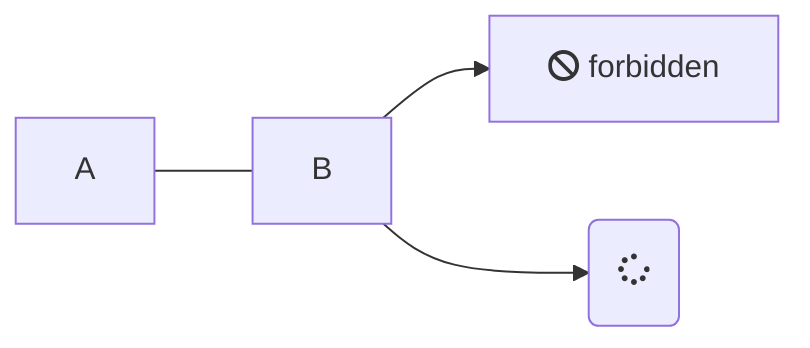
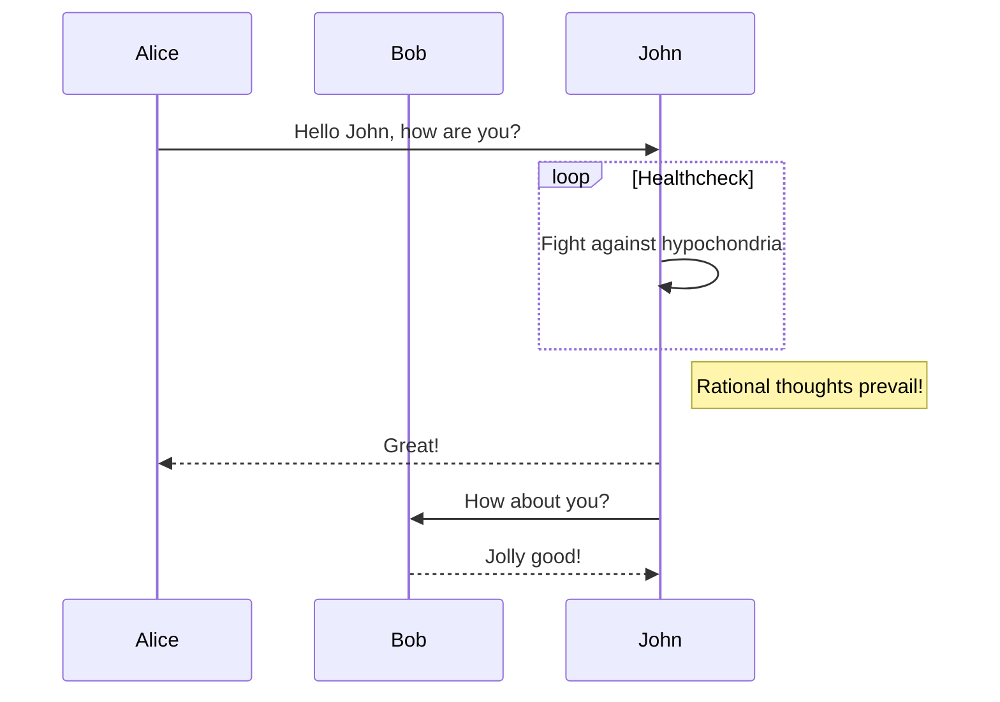

# Markdown写作技巧

## 面包屑提示

通过flexible-alerts插件实现提示，使用示例如下：

```
> [!NOTE]
> An alert of type 'note' using global style 'callout'.

> [!TIP]
> An alert of type 'tip' using global style 'callout'.

> [!WARNING]
> An alert of type 'warning' using global style 'callout'.

> [!ATTENTION]
> An alert of type 'attention' using global style 'callout'.

> [!TIP|style:flat|label:My own heading|iconVisibility:hidden]
> An alert of type 'tip' using alert specific style 'flat' which overrides global style 'callout'.
> In addition, this alert uses an own heading and hides specific icon.
```

## mermaid画图





## 符号大全

这里整理一些常见的emoji表情包，提供随时复制。

### EMOJI 表情

😊😋😎😍😙😚😇😐😑😏😣😥😮😯😪😫😴😌😜😝😒😓😔😕😲😷😖😞😟😤😢😭😦😧😨😬😰😱😳😵😡😠

### EMOJI 人物

👦👧👨👩👴👵👶👱👮👲👳👷👸💂🎅👰👼💆💇🙍🙎🙅🙆💁🙋🙇🙌🙏👤👥🚶🏃👯💃👫💑👪

### EMOJI 手势

💪👈👉☝👆👇✌✋👌👍👎✊👊👋👏👐✍

### EMOJI 日常

👣👀👂👃👅👄💋👓👔👕👖👗👘👙👚👛👜👝🎒💼👞👟👠👡👢👑👒🎩🎓💄💅💍🌂

### EMOJI 手机

📱📲📶📳📴☎📞📟📠

### EMOJI 公共

♻🏧🚮🚰♿🚹🚺🚻🚼🚾⚠🚸⛔🚫🚳🚭🚯🚱🚷🔞💈

### EMOJI 动物

🙈🙊🐒🐶🐕🐩🐺🐱😸😹😽🐈🐯🐅🐆🐴🐎🐮🐂🐃🐄🐷🐖🐗🐽🐏🐑🐐🐪🐫🐘🐭🐁🐀🐹🐰🐇🐻🐨🐼🐾🐔🐓🐣🐤🐥🐦
🐧🐸🐊🐢🐍🐲🐉🐳🐋🐬🐟🐠🐡🐙🐚🐌🐛🐜🐝🐞🦋

### EMOJI 植物

💐🌸💮🌹🌺🌻🌼🌷🌱🌲🌳🌴🌵🌾🌿🍀🍁🍂🍃

### EMOJI 自然

🌍🌎🌏🌐🌑🌒🌓🌔🌕🌖🌗🌘🌙🌚🌛🌜☀🌝🌞⭐🌟🌠☁⛅☔⚡❄🔥💧🌊

### EMOJI 饮食

🍇🍈🍉🍊🍋🍌🍍🍎🍏🍐🍑🍒🍓🍅🍆🌽🍄🌰🍞🍖🍗🍔🍟🍕🍳🍲🍱🍘🍙🍚🍛🍜🍝🍠🍢🍣🍤🍥🍡🍦🍧🍨🍩🍪🎂🍰🍫🍬🍭🍮🍯🍼☕🍵🍶🍷🍸🍹🍺🍻🍴

### EMOJI 文体

🎪🎭🎨🎰🚣🛀🎫🏆⚽⚾🏀🏈🏉🎾🎱🎳⛳🎣🎽🎿🏂🏄🏇🏊🚴🚵🎯🎮🎲🎷🎸🎺🎻🎬

### EMOJI 恐怖

😈👿👹👺💀☠👻👽👾💣

### EMOJI 旅游

🌋🗻🏠🏡🏢🏣🏤🏥🏦🏨🏩🏪🏫🏬🏭🏯🏰💒🗼🗽⛪⛲🌁🌃🌆🌇🌉🌌🎠🎡🎢🚂🚃🚄🚅🚆🚇🚈🚉🚊🚝🚞🚋🚌🚍🚎🚏🚐🚑🚒🚓🚔🚕🚖🚗🚘🚚🚛🚜🚲
⛽🚨🚥🚦🚧⚓⛵🚤🚢✈💺🚁🚟🚠🚡🚀🎑🗿🛂🛃🛄🛅

### EMOJI 物品

💌💎🔪💈🚪🚽🚿🛁⌛⏳⌚⏰🎈🎉🎊🎎🎏🎐🎀🎁📯📻📱📲☎📞📟📠🔋🔌💻💽💾💿📀🎥📺📷📹📼🔍🔎🔬🔭📡💡🔦🏮📔📕📖📗📘📙📚📓📃📜📄📰📑
🔖💰💴💵💶💷💸💳✉📧📨📩📤📥📦📫📪📬📭📮✏✒📝📁📂📅📆📇📈📉📊📋📌📍📎📏📐✂🔒🔓🔏🔐🔑🔨🔫🔧🔩🔗💉💊🚬🔮🚩🎌💦💨

### EMOJI 标志

♠♥♦♣🀄🎴🔇🔈🔉🔊📢📣💤💢💬💭♨🌀🔔🔕✡✝🔯📛🔰🔱⭕✅

☑✔✖❌❎➕➖➗➰➿〽✳✴❇‼⁉❓❔❕❗©®™🎦🔅🔆💯

🔠🔡🔢🔣🔤🅰🆎🅱🆑🆒🆓ℹ🆔Ⓜ🆕🆖🅾🆗🅿🆘

🆙🆚🈁🈂🈷🈶🈯🉐🈹🈚🈲🉑🈸🈴🈳㊗㊙🈺🈵

### EMOJI 生肖

🐁🐂🐅🐇🐉🐍🐎🐐🐒🐓🐕🐖

### EMOJI 钟表

🕛🕧🕐🕜🕑🕝🕒🕞🕓🕟🕔🕠🕕🕡🕖🕢🕗🕣🕘🕤🕙🕥🕚🕦⌛⏳⌚⏰⏱⏲🕰

### EMOJI 心形

💘❤💓💔💕💖💗💙💚💛💜💝💞💟❣

### EMOJI 花草

💐🌸💮🌹🌺🌻🌼🌷🌱🌿🍀🍁🍂🍃

### EMOJI 月亮

🌑🌒🌓🌔🌕🌖🌗🌘🌙🌚🌛🌜🌝

### EMOJI 水果

🍇🍈🍉🍊🍋🍌🍍🍎🍏🍐🍑🍒🍓

### EMOJI 钱币

💴💵💶💷💰💸💳

### EMOJI 交通

🚂🚃🚄🚅🚆🚇🚈🚉🚊🚝🚞🚋🚌🚍🚎🚏🚐🚑🚒🚓🚔🚕🚖🚗🚘🚚🚛🚜🚲⛽🚨🚥🚦🚧⚓⛵🚣🚤🚢✈💺🚁🚟🚠🚡🚀

### EMOJI 建筑

🏠🏡🏢🏣🏤🏥🏦🏨🏩🏪🏫🏬🏭🏯🏰💒🗼🗽⛪🌆🌇🌉

### EMOJI 办公

📱📲☎📞📟📠🔋🔌💻💽💾💿📀🎥📺📷📹📼🔍🔎🔬🔭📡📔📕📖📗📘📙📚📓📃📜📄📰📑🔖💳✉📧📨📩📤📥📦📫📪📬📭
📮✏✒📝📁📂📅📆📇📈📉📊📋📌📍📎📏📐✂🔒🔓🔏🔐🔑

### EMOJI 箭头

⬆↗➡↘⬇↙⬅↖↕↔↩↪⤴⤵🔃🔄🔙🔚🔛🔜🔝
