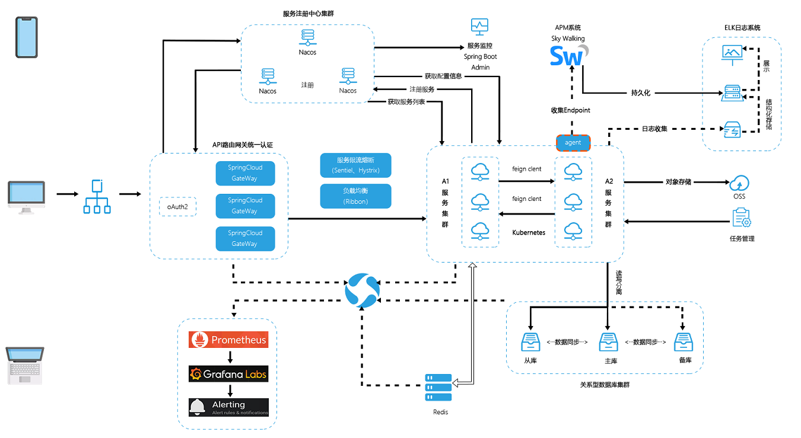

# LemonTree01-框架设计介绍

LemonTree（柠檬树）是个人设计的一套Java快速开发框架，基于Spring Cloud微服务架构技术栈搭建，旨在能快速构建业务基础代码。
开发周期计划一年左右完成：2022/02/01 - 2023/01/31。

主要特性如下：

* 采用前后端分离的模式，基于 Vue、Element-UI。
* 后端采用SpringCloud全家桶，微服务分布式架构。
* 集成Sentinel从流量控制、熔断降级、系统负载等多个维度保护服务的稳定性。
* 注册中心、配置中心选型Nacos，为工程瘦身的同时加强各模块之间的联动。
* 基于SpringSecurityOAuth2，实现了多终端认证系统，可控制子系统的token权限互相隔离。
* 项目分包明确，规范微服务的开发模式，使包与包之间的分工清晰。
* 源代码生成，可快速实现业务代码的新增。
* 部署采用K8S + Jenkins的部署架构。

整体架构如下

