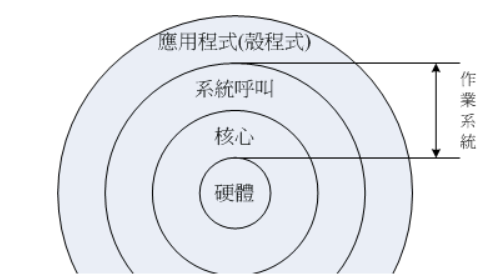

# 基础设施简介

计算机是由一堆硬件所组成的，为了有效率的控制这些硬件资源，于是乎就有操作系统的产生了。 操作系统除了有效率的控制这些硬件资源的分配，并提供计算机运作所需要的功能(如网络功能)之外，
为了要提供程序设计师更容易开发软件的环境，所以操作系统也会提供一整组系统呼叫接口来给软件设计师开发用喔！

知道为什么要讲这些了吗？嘿嘿！没错，因为Linux就是一套操作系统！如同下图所示，Linux就是核心与系统呼叫接口那两层。 至于应用程序算不算Linux呢？当然不算啦！这点要特别注意喔！

由上图中我们可以看到其实核心与硬件的关系非常的强烈。早期的Linux是针对386来开发的， 由于Linux只是一套操作系统并不含有其他的应用程序，因此很多工程师在下载了Linux核心并且实际安装之后， 就只能看着计算机开始运作了！
接下来这些高级工程师为了自己的需求，再在Linux上面安装他们所需要的软件就是了。

Linux提供了一个完整的操作系统当中最底层的硬件控制与资源管理的完整架构，这个架构是沿袭Unix良好的传统来的， 所以相当的稳定而功能强大！此外， 由于这个优良的架构可以在目前的个人计算机(x86系统)上面跑，
所以很多的软件开发者渐渐的将他们的工作心血移转到这个架构上面，所以 Linux 操作系统也有很多的应用软件啦！

虽然Linux仅是其核心与核心提供的工具，不过由于核心、核心工具与这些软件开发者提供的软件的整合， 使得Linux成为一个更完整的、功能强大的操作系统啰！

参考地址：http://cn.linux.vbird.org/linux_basic/0110whatislinux_1.php

