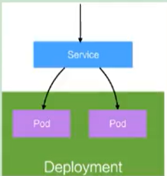
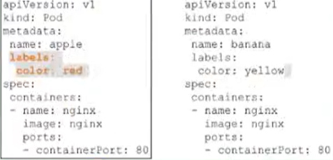

# Docker&Kubernetes简介

## Docker简介

Docker 是一个开源的应用容器引擎，基于 Go 语言并遵从 Apache2.0 协议开源。

Docker 可以让开发者打包他们的应用以及依赖包到一个轻量级、可移植的容器中，然后发布到任何流行的 Linux 机器上，也可以实现虚拟化。

容器是完全使用沙箱机制，相互之间不会有任何接口（类似 iPhone 的 app）,更重要的是容器性能开销极低。

Docker 从 17.03 版本之后分为 CE（Community Edition: 社区版）和 EE（Enterprise Edition: 企业版），我们用社区版就可以了。

### Docker的应用场景

1. Web应用的自动化打包和发布。
2. 自动化测试和持续集成、发布。
3. 在服务型环境中部署和调整数据库或其他的后台应用。
4. 从头编译或者扩展现有的 OpenShift 或 Cloud Foundry 平台来搭建自己的 PaaS 环境。

### Docker的优点

Docker 是一个用于开发，交付和运行应用程序的开放平台。Docker 使您能够将应用程序与基础架构分开，从而可以快速交付软件。 借助 Docker，您可以与管理应用程序相同的方式来管理基础架构。通过利用 Docker
的方法来快速交付，测试和部署代码， 您可以大大减少编写代码和在生产环境中运行代码之间的延迟。

**_1、快速，一致地交付您的应用程序_**

Docker 允许开发人员使用您提供的应用程序或服务的本地容器在标准化环境中工作，从而简化了开发的生命周期。

容器非常适合持续集成和持续交付（CI / CD）工作流程，请考虑以下示例方案：

* 您的开发人员在本地编写代码，并使用 Docker 容器与同事共享他们的工作。
* 他们使用 Docker 将其应用程序推送到测试环境中，并执行自动或手动测试。
* 当开发人员发现错误时，他们可以在开发环境中对其进行修复，然后将其重新部署到测试环境中，以进行测试和验证。
* 测试完成后，将修补程序推送给生产环境，就像将更新的镜像推送到生产环境一样简单。

**_2、响应式部署和扩展_**

Docker 是基于容器的平台，允许高度可移植的工作负载。Docker 容器可以在开发人员的本机上，数据中心的物理或虚拟机上，云服务上或混合环境中运行。

Docker 的可移植性和轻量级的特性，还可以使您轻松地完成动态管理的工作负担，并根据业务需求指示，实时扩展或拆除应用程序和服务。

**_3、在同一硬件上运行更多工作负载_**

Docker 轻巧快速。它为基于虚拟机管理程序的虚拟机提供了可行、经济、高效的替代方案，因此您可以利用更多的计算能力来实现业务目标。 Docker 非常适合于高密度环境以及中小型部署，而您可以用更少的资源做更多的事情。

### 官方网站

Docker 官网：https://www.docker.com

Github 源码：https://github.com/docker/docker-ce

## kubernetes简介
kubernetes，简称K8s，是用8 代替8 个字符“ubernete”而成的缩写。是一个开源的，用于管理云平台中多个主机上的容器化的应用，
Kubernetes的目标是让部署容器化的应用简单并且高效（powerful）,Kubernetes 提供了应用部署，规划，更新，维护的一种机制。

传统的应用部署方式是通过插件或脚本来安装应用。这样做的缺点是应用的运行、配置、管理、所有生存周期将与当前操作系统绑定，
这样做并不利于应用的升级更新/回滚等操作，当然也可以通过创建虚拟机的方式来实现某些功能，但是虚拟机非常重，并不利于可移植性。

新的方式是通过部署容器方式实现，每个容器之间互相隔离，每个容器有自己的文件系统，容器之间进程不会相互影响，能区分计算资源。 相对于虚拟机，容器能快速部署，由于容器与底层设施、机器文件系统解耦的。

> 总结：
>
> - K8s是谷歌在2014年发布的容器化集群管理系统
> - 使用k8s进行容器化应用部署
> - 使用k8s利于应用扩展
> - k8s目标实施让部署容器化应用更加简洁和高效

### K8S概述

Kubernetes 是一个轻便的和可扩展的开源平台，用于管理容器化应用和服务。通过Kubernetes 能够进行应用的自动化部署和扩缩容。 在Kubernetes 中，会将组成应用的容器组合成一个逻辑单元以更易管理和发现。

Kubernetes 积累了作为Google 生产环境运行工作负载15 年的经验，并吸收了来自于社区的最佳想法和实践。

### K8S功能

#### 自动装箱

基于容器对应用运行环境的资源配置要求自动部署应用容器

#### 自我修复(自愈能力)

当容器失败时，会对容器进行重启

当所部署的Node节点有问题时，会对容器进行重新部署和重新调度

当容器未通过监控检查时，会关闭此容器直到容器正常运行时，才会对外提供服务

如果某个服务器上的应用不响应了，Kubernetes会自动在其它的地方创建一个

#### 水平扩展

通过简单的命令、用户UI 界面或基于CPU 等资源使用情况，对应用容器进行规模扩大或规模剪裁

> 当我们有大量的请求来临时，我们可以增加副本数量，从而达到水平扩展的效果

当黄色应用过度忙碌，会来扩展一个应用

#### 服务发现

用户不需使用额外的服务发现机制，就能够基于Kubernetes 自身能力实现服务发现和负载均衡

> 对外提供统一的入口，让它来做节点的调度和负载均衡， 相当于微服务里面的网关？

#### 滚动更新

可以根据应用的变化，对应用容器运行的应用，进行一次性或批量式更新

> 添加应用的时候，不是加进去就马上可以进行使用，而是需要判断这个添加进去的应用是否能够正常使用

#### 版本回退

可以根据应用部署情况，对应用容器运行的应用，进行历史版本即时回退

> 类似于Git中的回滚

#### 密钥和配置管理

在不需要重新构建镜像的情况下，可以部署和更新密钥和应用配置，类似热部署。

#### 存储编排

自动实现存储系统挂载及应用，特别对有状态应用实现数据持久化非常重要

存储系统可以来自于本地目录、网络存储(NFS、Gluster、Ceph 等)、公共云存储服务

#### 批处理

提供一次性任务，定时任务；满足批量数据处理和分析的场景

### K8S架构组件

#### 完整架构图

#### 架构细节

K8S架构主要包含两部分：Master（主控节点）和 node（工作节点）

master节点架构图

Node节点架构图

k8s 集群控制节点，对集群进行调度管理，接受集群外用户去集群操作请求；

- **master**：主控节点
    - API Server：集群统一入口，以restful风格进行操作，同时交给etcd存储
        - 提供认证、授权、访问控制、API注册和发现等机制
    - scheduler：节点的调度，选择node节点应用部署
    - controller-manager：处理集群中常规后台任务，一个资源对应一个控制器
    - etcd：存储系统，用于保存集群中的相关数据

- **Work node**：工作节点

    - Kubelet：master派到node节点代表，管理本机容器
        - 一个集群中每个节点上运行的代理，它保证容器都运行在Pod中
        - 负责维护容器的生命周期，同时也负责Volume(CSI) 和 网络(CNI)的管理
    - kube-proxy：提供网络代理，负载均衡等操作

- 容器运行环境【**Container Runtime**】

    - 容器运行环境是负责运行容器的软件
    - Kubernetes支持多个容器运行环境：Docker、containerd、cri-o、rktlet以及任何实现Kubernetes CRI (容器运行环境接口) 的软件。

- fluentd：是一个守护进程，它有助于提升 集群层面日志

### K8S核心概念

#### Pod

- Pod是K8s中最小的单元
- 一组容器的集合
- 共享网络【一个Pod中的所有容器共享同一网络】
- 生命周期是短暂的（服务器重启后，就找不到了）

#### Volume

- 声明在Pod容器中可访问的文件目录
- 可以被挂载到Pod中一个或多个容器指定路径下
- 支持多种后端存储抽象【本地存储、分布式存储、云存储】

#### Controller

- 确保预期的pod副本数量【ReplicaSet】
- 无状态应用部署【Depoltment】
    - 无状态就是指，不需要依赖于网络或者ip
- 有状态应用部署【StatefulSet】
    - 有状态需要特定的条件
- 确保所有的node运行同一个pod 【DaemonSet】
- 一次性任务和定时任务【Job和CronJob】

#### Deployment

- 定义一组Pod副本数目，版本等
- 通过控制器【Controller】维持Pod数目【自动回复失败的Pod】
- 通过控制器以指定的策略控制版本【滚动升级、回滚等】

#### Service

- 定义一组pod的访问规则
- Pod的负载均衡，提供一个或多个Pod的稳定访问地址
- 支持多种方式【ClusterIP、NodePort、LoadBalancer】

可以用来组合pod，同时对外提供服务

#### Label

label：标签，用于对象资源查询，筛选

#### Namespace

命名空间，逻辑隔离

- 一个集群内部的逻辑隔离机制【鉴权、资源】
- 每个资源都属于一个namespace
- 同一个namespace所有资源不能重复
- 不同namespace可以资源名重复

#### API

我们通过Kubernetes的API来操作整个集群

同时我们可以通过 kubectl 、ui、curl 最终发送 http + json/yaml 方式的请求给API Server，然后控制整个K8S集群，K8S中所有的资源对象都可以采用 yaml 或 json 格式的文件定义或描述

如下：使用yaml部署一个nginx的pod

### 完整流程

- 通过Kubectl提交一个创建RC（Replication Controller）的请求，该请求通过APlserver写入etcd
- 此时Controller Manager通过API Server的监听资源变化的接口监听到此RC事件
- 分析之后，发现当前集群中还没有它所对应的Pod实例
- 于是根据RC里的Pod模板定义一个生成Pod对象，通过APIServer写入etcd
- 此事件被Scheduler发现，它立即执行执行一个复杂的调度流程，为这个新的Pod选定一个落户的Node，然后通过API Server讲这一结果写入etcd中
- 目标Node上运行的Kubelet进程通过APiserver监测到这个"新生的Pod.并按照它的定义，启动该Pod并任劳任怨地负责它的下半生，直到Pod的生命结束
- 随后，我们通过Kubectl提交一个新的映射到该Pod的Service的创建请求
- ControllerManager通过Label标签查询到关联的Pod实例，然后生成Service的Endpoints信息，并通过APIServer写入到etod中，
- 接下来，所有Node上运行的Proxy进程通过APIServer查询并监听Service对象与其对应的Endponts信息，建立一个软件方式的负载均衡器来实现Service访问到后端Pod的流量转发功能
