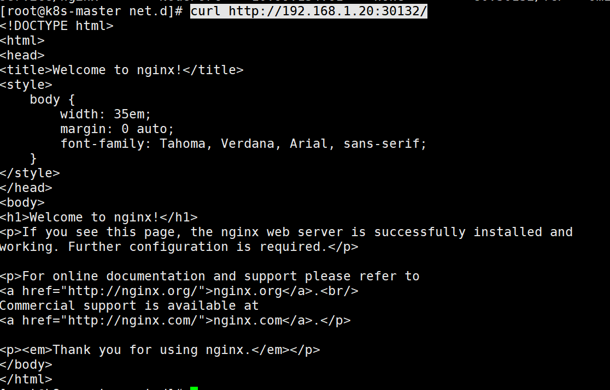

# K8S教程01-安装Kubernetes集群

在生产环境中都是使用集群方式来搭建K8S，这里记录一下如何通过kubeadm来部署K8S集群。
kubeadm是官方社区推出的一个用于快速部署kubernetes集群的工具。

## 安装CentOS7系统
在开始之前，部署Kubernetes集群机器需要满足以下几个条件：

- 一台或多台机器，操作系统 CentOS7.x-86_x64
- 硬件配置：2GB或更多RAM，2个CPU或更多CPU，硬盘30GB或更多【注意master需要两核】
- 可以访问外网，需要拉取镜像，如果服务器不能上网，需要提前下载镜像并导入节点
- 禁止swap分区

这里的虚拟机环境使用的CentOS7，通过VMWare或VirtualBox来安装4个虚拟机。一个是harbor，用来做镜像仓库用。
另外还有3台主机，一台安装管理面master，两台数据面的工作节点。安装CentOS7这里不多说，我只给出我这边安装好的环境信息。

| 角色   | IP              |
| ------ | --------------- |
| master | 192.168.1.20 |
| node1  | 192.168.1.21 |
| node2  | 192.168.1.22 |
| harbor | 192.168.1.30 |

另外，为了访问Google网站需要有科学上网方法，这里就不给出步骤了。

## 设置系统主机名以及Host文件的相互解析
```bash
# 登录k8s-master设置如下
hostnamectl set-hostname k8s-master
# 登录k8s-node01设置如下
hostnamectl set-hostname k8s-node01
# 登录k8s-node02设置如下
hostnamectl set-hostname k8s-node02
```
然后编辑3台主机的`/etc/hosts`文件，将主机名对应的ip写进去，保证可以通过主机名访问到其他节点。
```
192.168.1.20 k8s-master
192.168.1.21 k8s-node01
192.168.1.22 k8s-node02
```

## 安装依赖包
```bash
yum install -y conntrack ntpdate ntp ipvsadm ipset jq iptables curl sysstat libseccomp wgetvimnet-tools git
```

## 设置防火墙为 iptables 并设置空规则
```bash
systemctl stop firewalld && systemctl disable firewalld
yum -y install iptables-services \
    && systemctl start iptables \
    && systemctl enable iptables \
    &&  iptables -F  \
    &&  service iptables save
```

## 关闭swap和selinux
```bash
swapoff -a && sed -i '/ swap / s/^\(.*\)$/#\1/g' /etc/fstab
setenforce 0 && sed -i 's/^SELINUX=.*/SELINUX=disabled/' /etc/selinux/config
```

## 调整内核参数
```bash
cat > kubernetes.conf <<EOF
net.bridge.bridge-nf-call-iptables=1
net.bridge.bridge-nf-call-ip6tables=1
net.ipv4.ip_forward=1
net.ipv4.tcp_tw_recycle=0
vm.swappiness=0 # 禁止使用 swap 空间，只有当系统 OOM 时才允许使用它
vm.overcommit_memory=1 # 不检查物理内存是否够用
vm.panic_on_oom=0 # 开启 OOM
fs.inotify.max_user_instances=8192
fs.inotify.max_user_watches=1048576
fs.file-max=52706963
fs.nr_open=52706963
net.ipv6.conf.all.disable_ipv6=1
net.netfilter.nf_conntrack_max=2310720
EOF
cp kubernetes.conf /etc/sysctl.d/kubernetes.conf
sysctl -p /etc/sysctl.d/kubernetes.conf
```

## 调整系统时区
```bash
# 设置系统时区为中国/上海
timedatectl set-timezone Asia/Shanghai
# 将当前的 UTC 时间写入硬件时钟
timedatectl set-local-rtc 0
# 重启依赖于系统时间的服务
systemctl restart rsyslog
systemctl restart crond
```

## 关闭系统不需要服务
```bash
systemctl stop postfix && systemctl disable postfix
```

## 设置 rsyslogd 和 systemd journald
```bash
mkdir /var/log/journal # 持久化保存日志的目录
mkdir /etc/systemd/journald.conf.d
cat > /etc/systemd/journald.conf.d/99-prophet.conf <<EOF
[Journal]
# 持久化保存到磁盘
Storage=persistent

# 压缩历史日志
Compress=yes

SyncIntervalSec=5m
RateLimitInterval=30s
RateLimitBurst=1000

# 最大占用空间 10G
SystemMaxUse=10G

# 单日志文件最大 200M
SystemMaxFileSize=200M

# 日志保存时间 2 周
MaxRetentionSec=2week

# 不将日志转发到 syslog
ForwardToSyslog=no
EOF
systemctl restart systemd-journald
```

## 升级系统内核为 5.4.x

CentOS 7.x 系统自带的 3.10.x 内核存在一些 Bugs，导致运行的 Docker、Kubernetes 不稳定。
建议更新内核到5.4.x。
```bash
# 查看内核版本
uname -r
# 如果内核还是3.x，则需要升级
rpm -Uvh http://www.elrepo.org/elrepo-release-7.0-3.el7.elrepo.noarch.rpm
# 安装完成后检查 /boot/grub2/grub.cfg 中对应内核 menuentry 中是否包含 initrd16 配置，如果没有，再安装一次！
yum --enablerepo=elrepo-kernel install -y kernel-lt
# 设置开机从新内核启动
grub2-set-default 'CentOS Linux (5.4.92-1.el7.elrepo.x86_64) 7 (Core)'
```

## kube-proxy开启ipvs的前置条件
```bash
modprobe br_netfilter

cat > /etc/sysconfig/modules/ipvs.modules <<EOF
#!/bin/bash
modprobe -- ip_vs
modprobe -- ip_vs_rr
modprobe -- ip_vs_wrr
modprobe -- ip_vs_sh
EOF
chmod 755 /etc/sysconfig/modules/ipvs.modules
bash /etc/sysconfig/modules/ipvs.modules
lsmod | grep -e ip_vs -e nf_conntrack_ipv4
```

## 安装 Docker 软件

开启yum源国内加速
```bash
curl -o /etc/yum.repos.d/CentOS-Base.repo http://mirrors.aliyun.com/repo/Centos-7.repo
sed -i 's/http:/https:/g' /etc/yum.repos.d/CentOS-Base.repo
yum clean all && yum makecache && yum update -y
```

首先卸载老版本
```bash
yum remove -y docker \
  docker-ce \
  docker-client \
  docker-client-latest \
  docker-common \
  docker-latest \
  docker-latest-logrotate \
  docker-logrotate \
  docker-engine
```

如果曾经安装过，`/var/lib/docker/`中会有原来的镜像、容器、卷以及网络残留，如果不需要可将之一并删除。
```bash
rm -rf /var/lib/docker
```

安装 yum 配置管理工具
```bash
yum install -y yum-utils device-mapper-persistent-data lvm2
```

首先配置一下Docker的阿里yum源

```bash
cat >/etc/yum.repos.d/docker-ce.repo<<EOF
[docker-ce-edge]
name=Docker CE Edge - \$basearch
baseurl=https://mirrors.aliyun.com/docker-ce/linux/centos/7/\$basearch/edge
enabled=1
gpgcheck=1
gpgkey=https://mirrors.aliyun.com/docker-ce/linux/centos/gpg
EOF
```

安装最新的Docker CE
```bash
yum install -y docker-ce docker-ce-cli containerd.io
```

配置docker，关于加速器的地址，您登录[容器镜像服务控制台](https://cr.console.aliyun.com)后，在左侧导航栏选择`镜像工具` > `镜像加速器`，
在镜像加速器页面就会显示为您独立分配的加速器地址。
```bash
cat > /etc/docker/daemon.json <<EOF
{
    "registry-mirrors": ["https://30y4mr57.mirror.aliyuncs.com"],
    "exec-opts": [
        "native.cgroupdriver=systemd"
    ], 
    "log-driver": "json-file", 
    "log-opts": {
        "max-size": "100m"
    }
}
EOF
```

开机启动docker
```bash
systemctl enable docker && systemctl restart docker
```

## 安装 Kubeadm
在每台节点都执行如下命令安装kubeadm
```bash
cat <<EOF > /etc/yum.repos.d/kubernetes.repo
[kubernetes]
name=Kubernetes
baseurl=https://mirrors.aliyun.com/kubernetes/yum/repos/kubernetes-el7-x86_64
enabled=1
gpgcheck=0
repo_gpgcheck=0
gpgkey=https://mirrors.aliyun.com/kubernetes/yum/doc/yum-key.gpg http://mirrors.aliyun.com/kubernetes/yum/doc/rpm-package-key.gpg
EOF
# 安装kubelet、kubeadm、kubectl，同时指定版本
yum install -y kubelet-1.18.0 kubeadm-1.18.0 kubectl-1.18.0
systemctl enable kubelet
```

## 部署Kubernetes master节点

在master（IP地址为192.168.1.20）节点上面执行
```bash
kubeadm init --apiserver-advertise-address=192.168.1.20 \
    --image-repository registry.aliyuncs.com/google_containers \
    --kubernetes-version v1.18.0 \
    --service-cidr=10.96.0.0/12  \
    --pod-network-cidr=10.244.0.0/16
```

由于默认拉取镜像地址`k8s.gcr.io`国内无法访问，这里指定阿里云镜像仓库地址，
【执行上述命令会比较慢，因为后台其实已经在拉取镜像了】，我们 `docker images` 命令即可查看已经拉取的镜像。

当我们出现下面的情况时，表示kubernetes的镜像已经安装成功


使用kubectl工具【master节点操作】
```bash
mkdir -p $HOME/.kube
sudo cp -i /etc/kubernetes/admin.conf $HOME/.kube/config
sudo chown $(id -u):$(id -g) $HOME/.kube/config
```

执行完成后，我们使用下面命令，查看我们正在运行的节点
```bash
kubectl get nodes
```
能够看到，目前有一个master节点已经运行了，但是还处于未准备状态。
下面我们还需要在Node节点执行其它的命令，将node1和node2加入到我们的集群中。

## 加入Kubernetes Node节点
下面我们需要到 node1 和 node2服务器，执行下面的代码向集群添加新节点。

> 注意，以下的命令是在master初始化完成后，每个人的都不一样！！！需要复制自己生成的

```bash
kubeadm join 192.168.1.20:6443 --token mgz5ib.v2ln7izb335i4jao \
    --discovery-token-ca-cert-hash sha256:05a3bfd6f43b84cf886f6e4ed44076d35f4d5f0d9a3c5ba43bab346de2e62e91
```

默认token有效期为24小时，当过期之后，该token就不可用了。这时就需要重新在master节点创建token，操作如下：

```
kubeadm token create --print-join-command
```

当我们把两个节点都加入进来后，我们就可以去Master节点 执行下面命令查看情况
```bash
kubectl get node
```


## 部署CNI网络插件

上面的状态还是NotReady，下面我们需要网络插件，来进行联网访问。在master节点执行
```bash
# 下载
https://raw.githubusercontent.com/coreos/flannel/master/Documentation/kube-flannel.yml
# 添加
kubectl apply -f kube-flannel.yml
# 查看状态 【kube-system是k8s中的最小单元】
kubectl get pods -n kube-system
```

运行完成后，我们查看状态可以发现，已经变成了Ready状态了


如果上述操作完成后，还存在某个节点（比如k8s-node02）处于NotReady状态，可以通过如下方法修复。
```bash
kubectl get pods -n kube-system
# 再进一步看pod日志，一般原因可能是镜像还没拉下来。网络很慢，需要等待镜像拉取完就好了
kubectl describe pod kube-flannel-ds-kxfqv -n kube-system
# 如果实在不行，还可以试试master节点将该节点删除
kubectl delete node k8s-node02
# 然后到k8s-node02节点进行重置
kubeadm reset
# 重置完后在加入
# kubeadm join xxx
```

## 测试kubernetes集群
我们都知道K8S是容器化技术，它可以联网去下载镜像，用容器的方式进行启动。
在Kubernetes集群中创建一个pod，验证是否正常运行：
```bash
# 下载nginx 【会联网拉取nginx镜像】
kubectl create deployment nginx --image=nginx
# 查看状态
kubectl get pod
```
如果我们出现Running状态的时候，表示已经成功运行了


下面我们就需要将端口暴露出去，让其它外界能够访问
```bash
kubectl expose deployment nginx --port=80 --type=NodePort
# 查看一下对外的端口
kubectl get pod,svc
```


能够看到，我们已经成功暴露了80端口到30132上了。 然后再宿主机上面访问这个地址，能访问通则表示成功了。


到这里为止，我们就搭建了一个单master的k8s集群。