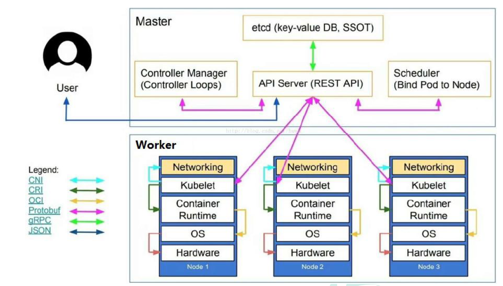
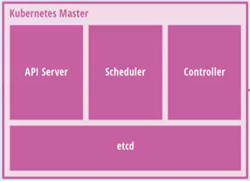
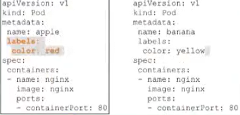

# Kubernetes简介

kubernetes，简称K8s，是用8 代替8 个字符“ubernete”而成的缩写。是一个开源的，用于管理云平台中多个主机上的容器化的应用，
Kubernetes的目标是让部署容器化的应用简单并且高效（powerful）,Kubernetes 提供了应用部署，规划，更新，维护的一种机制。

传统的应用部署方式是通过插件或脚本来安装应用。这样做的缺点是应用的运行、配置、管理、所有生存周期将与当前操作系统绑定，
这样做并不利于应用的升级更新/回滚等操作，当然也可以通过创建虚拟机的方式来实现某些功能，但是虚拟机非常重，并不利于可移植性。

新的方式是通过部署容器方式实现，每个容器之间互相隔离，每个容器有自己的文件系统，容器之间进程不会相互影响，能区分计算资源。 相对于虚拟机，容器能快速部署，由于容器与底层设施、机器文件系统解耦的。

> 总结：
>
> - K8s是谷歌在2014年发布的容器化集群管理系统
> - 使用k8s进行容器化应用部署
> - 使用k8s利于应用扩展
> - k8s目标实施让部署容器化应用更加简洁和高效

## K8S概述

Kubernetes 是一个轻便的和可扩展的开源平台，用于管理容器化应用和服务。通过Kubernetes 能够进行应用的自动化部署和扩缩容。 在Kubernetes 中，会将组成应用的容器组合成一个逻辑单元以更易管理和发现。

Kubernetes 积累了作为Google 生产环境运行工作负载15 年的经验，并吸收了来自于社区的最佳想法和实践。

## K8S功能

### 自动装箱

基于容器对应用运行环境的资源配置要求自动部署应用容器

### 自我修复(自愈能力)

当容器失败时，会对容器进行重启

当所部署的Node节点有问题时，会对容器进行重新部署和重新调度

当容器未通过监控检查时，会关闭此容器直到容器正常运行时，才会对外提供服务

如果某个服务器上的应用不响应了，Kubernetes会自动在其它的地方创建一个

### 水平扩展

通过简单的命令、用户UI 界面或基于CPU 等资源使用情况，对应用容器进行规模扩大或规模剪裁

> 当我们有大量的请求来临时，我们可以增加副本数量，从而达到水平扩展的效果

当黄色应用过度忙碌，会来扩展一个应用

### 服务发现

用户不需使用额外的服务发现机制，就能够基于Kubernetes 自身能力实现服务发现和负载均衡

> 对外提供统一的入口，让它来做节点的调度和负载均衡， 相当于微服务里面的网关？

### 滚动更新

可以根据应用的变化，对应用容器运行的应用，进行一次性或批量式更新

> 添加应用的时候，不是加进去就马上可以进行使用，而是需要判断这个添加进去的应用是否能够正常使用

### 版本回退

可以根据应用部署情况，对应用容器运行的应用，进行历史版本即时回退

> 类似于Git中的回滚

### 密钥和配置管理

在不需要重新构建镜像的情况下，可以部署和更新密钥和应用配置，类似热部署。

### 存储编排

自动实现存储系统挂载及应用，特别对有状态应用实现数据持久化非常重要

存储系统可以来自于本地目录、网络存储(NFS、Gluster、Ceph 等)、公共云存储服务

### 批处理

提供一次性任务，定时任务；满足批量数据处理和分析的场景

## K8S架构组件

### 完整架构图

### 架构细节

K8S架构主要包含两部分：Master（主控节点）和 node（工作节点）

master节点架构图

Node节点架构图

k8s 集群控制节点，对集群进行调度管理，接受集群外用户去集群操作请求；

- **master**：主控节点
    - API Server：集群统一入口，以restful风格进行操作，同时交给etcd存储
        - 提供认证、授权、访问控制、API注册和发现等机制
    - scheduler：节点的调度，选择node节点应用部署
    - controller-manager：处理集群中常规后台任务，一个资源对应一个控制器
    - etcd：存储系统，用于保存集群中的相关数据

- **Work node**：工作节点

    - Kubelet：master派到node节点代表，管理本机容器
        - 一个集群中每个节点上运行的代理，它保证容器都运行在Pod中
        - 负责维护容器的生命周期，同时也负责Volume(CSI) 和 网络(CNI)的管理
    - kube-proxy：提供网络代理，负载均衡等操作

- 容器运行环境【**Container Runtime**】

    - 容器运行环境是负责运行容器的软件
    - Kubernetes支持多个容器运行环境：Docker、containerd、cri-o、rktlet以及任何实现Kubernetes CRI (容器运行环境接口) 的软件。

- fluentd：是一个守护进程，它有助于提升 集群层面日志

## K8S核心概念

### Pod

- Pod是K8s中最小的单元
- 一组容器的集合
- 共享网络【一个Pod中的所有容器共享同一网络】
- 生命周期是短暂的（服务器重启后，就找不到了）

### Volume

- 声明在Pod容器中可访问的文件目录
- 可以被挂载到Pod中一个或多个容器指定路径下
- 支持多种后端存储抽象【本地存储、分布式存储、云存储】

### Controller

- 确保预期的pod副本数量【ReplicaSet】
- 无状态应用部署【Depoltment】
    - 无状态就是指，不需要依赖于网络或者ip
- 有状态应用部署【StatefulSet】
    - 有状态需要特定的条件
- 确保所有的node运行同一个pod 【DaemonSet】
- 一次性任务和定时任务【Job和CronJob】

### Deployment

- 定义一组Pod副本数目，版本等
- 通过控制器【Controller】维持Pod数目【自动回复失败的Pod】
- 通过控制器以指定的策略控制版本【滚动升级、回滚等】

### Service

- 定义一组pod的访问规则
- Pod的负载均衡，提供一个或多个Pod的稳定访问地址
- 支持多种方式【ClusterIP、NodePort、LoadBalancer】

可以用来组合pod，同时对外提供服务

### Label

label：标签，用于对象资源查询，筛选

### Namespace

命名空间，逻辑隔离

- 一个集群内部的逻辑隔离机制【鉴权、资源】
- 每个资源都属于一个namespace
- 同一个namespace所有资源不能重复
- 不同namespace可以资源名重复

### API

我们通过Kubernetes的API来操作整个集群

同时我们可以通过 kubectl 、ui、curl 最终发送 http + json/yaml 方式的请求给API Server，然后控制整个K8S集群，K8S中所有的资源对象都可以采用 yaml 或 json 格式的文件定义或描述

如下：使用yaml部署一个nginx的pod

## 完整流程

- 通过Kubectl提交一个创建RC（Replication Controller）的请求，该请求通过APlserver写入etcd
- 此时Controller Manager通过API Server的监听资源变化的接口监听到此RC事件
- 分析之后，发现当前集群中还没有它所对应的Pod实例
- 于是根据RC里的Pod模板定义一个生成Pod对象，通过APIServer写入etcd
- 此事件被Scheduler发现，它立即执行执行一个复杂的调度流程，为这个新的Pod选定一个落户的Node，然后通过API Server讲这一结果写入etcd中
- 目标Node上运行的Kubelet进程通过APiserver监测到这个"新生的Pod.并按照它的定义，启动该Pod并任劳任怨地负责它的下半生，直到Pod的生命结束
- 随后，我们通过Kubectl提交一个新的映射到该Pod的Service的创建请求
- ControllerManager通过Label标签查询到关联的Pod实例，然后生成Service的Endpoints信息，并通过APIServer写入到etod中，
- 接下来，所有Node上运行的Proxy进程通过APIServer查询并监听Service对象与其对应的Endponts信息，建立一个软件方式的负载均衡器来实现Service访问到后端Pod的流量转发功能
