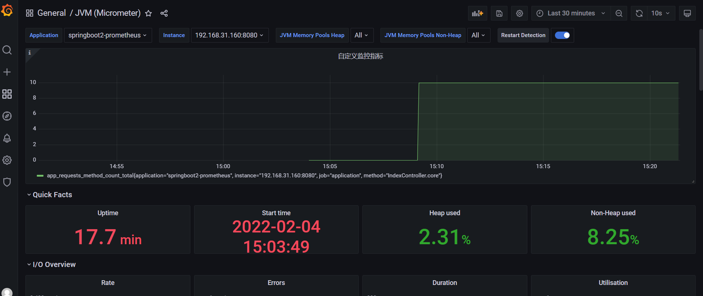
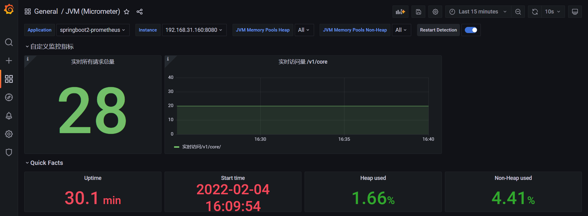

# Prometheus监控SpringBoot

## Micrometer 介绍
Micrometer 为 Java 平台上的性能数据收集提供了一个通用的 API，
它提供了多种度量指标类型（Timers、Guauges、Counters等），同时支持接入不同的监控系统，
例如 Influxdb、Graphite、Prometheus 等。我们可以通过 Micrometer 收集 Java 性能数据，
配合 Prometheus 监控系统实时获取数据，并最终在 Grafana 上展示出来，从而很容易实现应用的监控。

<span style="color: red;">简单地说，actuator 是真正去采集数据的模块，而 Micrometer 更像是一个适配器，
将 actuator 采集到的数据适合给各种监控工具。</span>

Micrometer 中有两个最核心的概念，分别是计量器（Meter）和计量器注册表（MeterRegistry）。
计量器用来收集不同类型的性能指标信息，Micrometer 提供了如下几种不同类型的计量器：

* 计数器（Counter）: 表示收集的数据是按照某个趋势（增加／减少）一直变化的，也是最常用的一种计量器，
例如接口请求总数、请求错误总数、队列数量变化等。
* 计量仪（Gauge）: 表示搜集的瞬时的数据，可以任意变化的，例如常用的 CPU Load、Mem 使用量、
Network 使用量、实时在线人数统计等。
* 计时器（Timer）: 用来记录事件的持续时间，这个用的比较少。
* 分布概要（Distribution summary）: 用来记录事件的分布情况，表示一段时间范围内对数据进行采样，
可以用于统计网络请求平均延迟、请求延迟占比等。

## Spring Boot 工程集成 Micrometer
我们一般说 Spring Boot 集成 Micrometer 值得时 Spring 2.x 版本，
因为在该版本 spring-boot-actuator 使用了 Micrometer 来实现监控。

pom.xml配置如下：
``` xml
<?xml version="1.0" encoding="UTF-8"?>
<project xmlns="http://maven.apache.org/POM/4.0.0" xmlns:xsi="http://www.w3.org/2001/XMLSchema-instance"
         xsi:schemaLocation="http://maven.apache.org/POM/4.0.0 https://maven.apache.org/xsd/maven-4.0.0.xsd">
    <modelVersion>4.0.0</modelVersion>
    <parent>
        <groupId>org.springframework.boot</groupId>
        <artifactId>spring-boot-starter-parent</artifactId>
        <version>2.6.2</version>
        <relativePath/> <!-- lookup parent from repository -->
    </parent>
    <groupId>com.xncoding</groupId>
    <artifactId>springmvc-demo</artifactId>
    <version>0.0.1-SNAPSHOT</version>
    <name>springmvc-demo</name>
    <description>springmvc-demo</description>
    <properties>
        <java.version>11</java.version>
    </properties>
    <dependencies>
        <dependency>
            <groupId>org.springframework.boot</groupId>
            <artifactId>spring-boot-starter-actuator</artifactId>
        </dependency>
        <dependency>
            <groupId>io.micrometer</groupId>
            <artifactId>micrometer-registry-prometheus</artifactId>
            <scope>runtime</scope>
        </dependency>
        <dependency>
            <groupId>org.springframework.boot</groupId>
            <artifactId>spring-boot-starter-web</artifactId>
        </dependency>
        <dependency>
            <groupId>org.springframework.boot</groupId>
            <artifactId>spring-boot-starter-test</artifactId>
            <scope>test</scope>
        </dependency>
    </dependencies>
    <build>
        <plugins>
            <plugin>
                <groupId>org.springframework.boot</groupId>
                <artifactId>spring-boot-maven-plugin</artifactId>
            </plugin>
        </plugins>
    </build>
</project>
```

这里引入了 io.micrometer 的 micrometer-registry-prometheus 依赖以及 spring-boot-starter-actuator 依赖，
因为该包对 Prometheus 进行了封装，可以很方便的集成到 Spring Boot 工程中。

其次在 application.properties 中配置如下：
```properties
server.port=8080
spring.application.name=springboot2-prometheus

management.endpoints.web.exposure.include=*
management.endpoint.health.show-details=always
management.endpoint.metrics.enabled=true
management.endpoint.prometheus.enabled=true
management.metrics.export.prometheus.enabled=true
management.metrics.tags.application=${spring.application.name}
```

这里 `management.endpoints.web.exposure.include=*` 配置为开启 Actuator 服务，
因为Spring Boot Actuator 会自动配置一个 URL 为 `/actuator/prometheus` 的 HTTP 服务来供 
Prometheus 抓取数据，不过默认该服务是关闭的，该配置将打开所有的 Actuator 服务。
`management.metrics.tags.application` 配置会将该工程应用名称添加到计量器注册表的 tag 中去，
方便后边 Prometheus 根据应用名称来区分不同的服务。

然后在工程启动主类中添加 Bean 如下来监控 JVM 性能指标信息：
``` java
@SpringBootApplication
public class SpringmvcDemoApplication {
    public static void main(String[] args) {
        SpringApplication.run(SpringmvcDemoApplication.class, args);
    }
    @Bean
    MeterRegistryCustomizer<MeterRegistry> configurer(@Value("${spring.application.name}") String applicationName) {
        return registry -> registry.config().commonTags("application", applicationName);
    }
}
```

最后，启动服务，浏览器访问 http://127.0.0.1:8080/actuator/prometheus 
就可以看到应用的一系列不同类型 metrics 信息，例如 `http_server_requests_seconds summary`、
`jvm_memory_used_bytes gauge`、`jvm_gc_memory_promoted_bytes_total counter` 等等。

## 配置 Prometheus 监控应用指标
修改 prometheus.yml 配置，在上篇文章配置示例基础上，添加上边启动的服务地址来执行监控。重启Prometheus容器。
```yaml
global:
  scrape_interval: 10s

scrape_configs:
  - job_name: node
    static_configs:
      - targets: ['service:9100']
  - job_name: 'application'
    scrape_interval: 5s
    metrics_path: '/actuator/prometheus'
    static_configs:
      - targets: ['192.168.31.160:8080']
```

## 配置 Grafana Dashboard 展示监控项
Prometheus 现在已经可以正常监控到应用 JVM 信息了，那么我们可以配置 Grafana Dashboard 来优雅直观的展示出来这些监控值了。
需要导入对应的监控 JVM 的 Dashboard 模板，模板编号为 4701。数据源选择上面配置好的Prometheus即可。


## 自定义监控指标并展示到 Grafana
上边是 spring-boot-actuator 集成了 Micrometer 来提供的默认监控项，覆盖 JVM 各个层间的监控，
配合 Grafana Dashboard 模板基本可以满足我们日常对 Java 应用的监控。当然，它也支持自定义监控指标，
实现各个方面的监控，例如统计访问某一个 API 接口的请求数，统计实时在线人数、统计实时接口响应时间等功能，
而这些都可以通过使用上边的四种计量器来实现。接下来，来演示下如何自定义监控指标并展示到 Grafana 上。

### 监控某几个 API 请求次数
我们继续在springboot2工程上添加 IndexController.java，来实现分别统计访问 index 及 core 接口请求次数。
``` java
@RestController
@RequestMapping("/v1")
public class IndexController {

    private final MeterRegistry registry;

    private Counter counter_core;
    private Counter counter_index;

    public IndexController(MeterRegistry registry) {
        this.registry = registry;
    }

    @PostConstruct
    private void init() {
        counter_core = registry.counter("app_requests_method_count", "method", "IndexController.core");
        counter_index = registry.counter("app_requests_method_count", "method", "IndexController.index");
    }

    @RequestMapping(value = "/index")
    public Object index() {
        try {
            counter_index.increment();
        } catch (Exception e) {
            return e;
        }
        return counter_index.count() + " index of springboot2-prometheus.";
    }

    @RequestMapping(value = "/core")
    public Object coreUrl() {
        try {
            counter_core.increment();
        } catch (Exception e) {
            return e;
        }
        return counter_core.count() + " coreUrl Monitor by Prometheus.";
    }
}
```

说明一下，这里是一个简单的 RestController 接口，使用了 Counter 计量器来统计访问 /v1/index 及 
/v1/core 接口访问量。因为访问数会持续的增加，所以这里使用 Counter 比较合适。启动服务，
我们来分别访问一下这两个接口，为了更好的配合下边演示，可以多访问几次。

接下来，我们可以到 Prometheus UI 界面上使用 PromSQL 查询自定义的监控信息了。
分别添加 Graph 并执行如下查询语句，查询结果如下：


* app_requests_method_count_total 为上边代码中设置的 Counter 名称。
* application 为初始化 registry 时设置的通用标签，标注应用名称，这样做好处就是可以根据应用名称区分不同的应用。
* method 为上边代码中设置的 Counter 标签名称，可以用来区分不同的方法，这样就不用为每一个方法设置一个 Counter 了。

接下来，我们在 Grafana Dashboard 上添加一个新的 Panel 并添加 Query 查询，最后图形化展示出来。

首先添加一个Row并命名为`自定义监控指标`。然后添加一个 Panel ，点击 Add Query 增加一个新的 Query 查询，
查询语句为上边的 PromSQL 语句，不过这里为了更好的扩展性，我们可以将 application 及 instance 两个参数赋值为变量，
而这些变量可以直接从 Prometheus 上传递过来，最终的查询语句为
```
app_requests_method_count_total{application="$application", instance="$instance", method="IndexController.core"}
```
最后修改Panel的 Title 为 `实时访问量 /v1/core`，保存一下，返回首页就可以看到刚添加的 Dashboard 了，是不是很直观。


### 监控所有 API 请求次数
上边针对某个或某几个接口请求次数做了监控，如果我们想针对整个应用监控所有接口请求总次数，这个该如何实现呢？
监控请求次数可以继续使用 Counter 计数器，整个应用所有请求，我们自然而然的想到了 Spring AOP，
通过切面注入可以做到统计所有请求记录，添加依赖如下：
``` xml
<dependency>
    <groupId>org.springframework.boot</groupId>
    <artifactId>spring-boot-starter-aop</artifactId>
</dependency>
```

添加一个切面：
``` java
@Component
@Aspect
public class AspectAop {
    @Autowired
    MeterRegistry registry;

    private Counter counter_total;

    ThreadLocal<Long> startTime = new ThreadLocal<>();

    @Pointcut("execution(public * com.xncoding.springmvcdemo.controller.*.*(..))")
    private void pointCut() {
    }

    @PostConstruct
    public void init() {
        counter_total = registry.counter("app_requests_count", "v1", "core");
    }

    @Before("pointCut()")
    public void doBefore(JoinPoint joinPoint) {
        startTime.set(System.currentTimeMillis());
        counter_total.increment();
    }

    @AfterReturning(returning = "returnVal", pointcut = "pointCut()")
    public void doAftereReturning(Object returnVal) {
        System.out.println("请求执行时间：" + (System.currentTimeMillis() - startTime.get()));
    }
}
```
在之前的Row中添加一个新的Panel，Title设置为`实时所有请求总量`，添加Query为如下：
```
app_requests_count_total{application="$application", instance="$instance", v1="core"}
```
同时修改图形的样式。如下：


