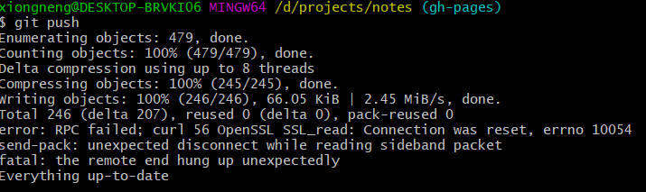

# Git常见问题FAQ

## 本地push出现RPC failed; curl 56 OpenSSL SSL_read: Connection was reset,

如图


原因：push过程中更新的文件过大，需要设置本地push的缓存区大小。

解决步骤：

1、首先输入如下命令：
```bash
git config --globle http.sslVerify "false"
```

2、文件大小的上限设置：
```bash
git config --global http.postBuffer 524288000
```

3、如果还是push失败，则需要继续修改git缓存的大小。

