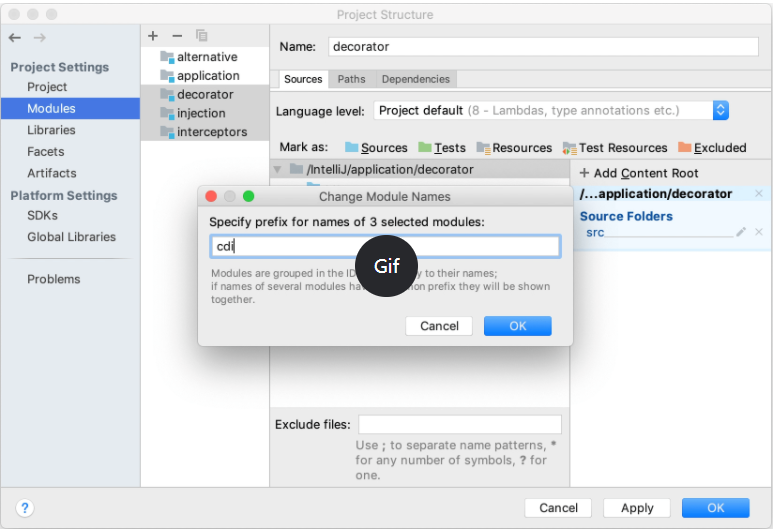

# IDEA中多模块项目分组技巧

通常一个项目中会分成多个模块，特别是微服务架构体系下。每个模块就是一个微服务，模块独立开发部署。 但是平时要维护多个模块，需要在IDEA中打开这些模块代码，之前总是一个窗口一个模块项目。这样我查看的时候需要经常切换，
非常的麻烦。其实IDEA也是支持类似Eclipse中那种Workspace下多个模块项目的。

1. 新建一个空项目（项目类型选择Empty Project）
2. 使用快捷键`Ctl + Shift + Alt + S`打开模块配置视图。在模块中导入或新建Module
3. 创建完所有的Module之后，就可以选中需要分组的模块，然后点击右键，选择`Change Module Names`，输入分组名称。

这里有个小bug就是，只能对多个模块分组。如果你有新添加的一个模块想加入到已有的分组中。则需要将分组中原来的模块先将分组名去掉， 方法是选后，设置分组名为空字符串即可。然后再将原来的模块跟这个新模块一起添加到分组中。

参考官方文档地址：https://www.jetbrains.com/help/idea/creating-and-managing-modules.html#grouping-modules
