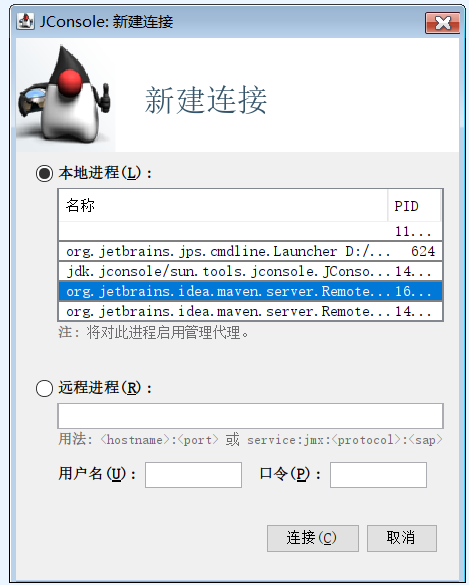
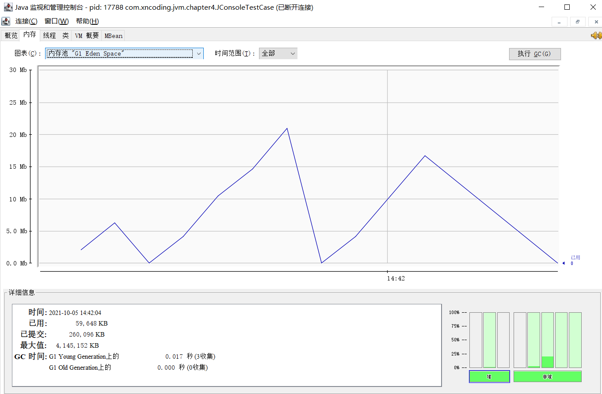
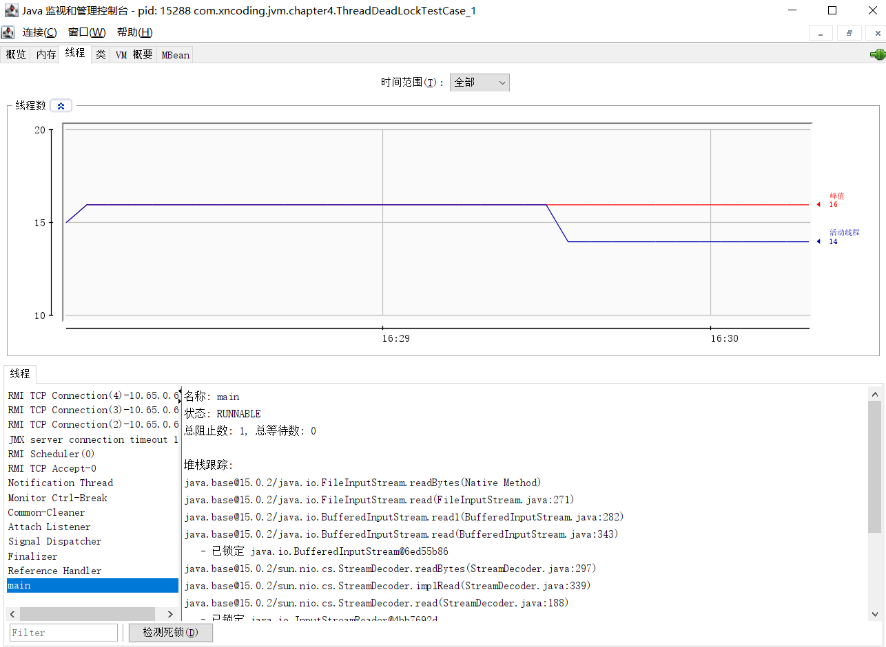
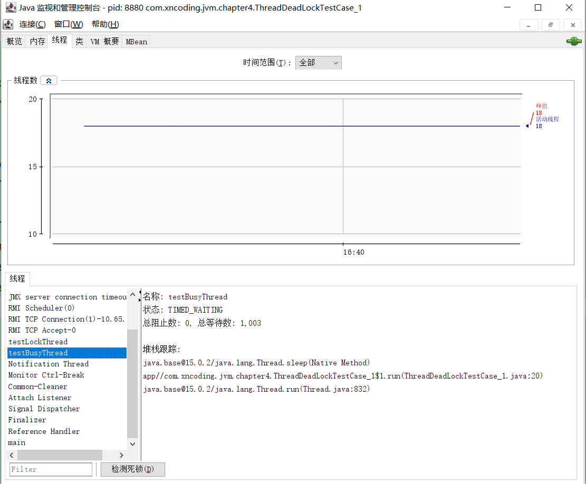
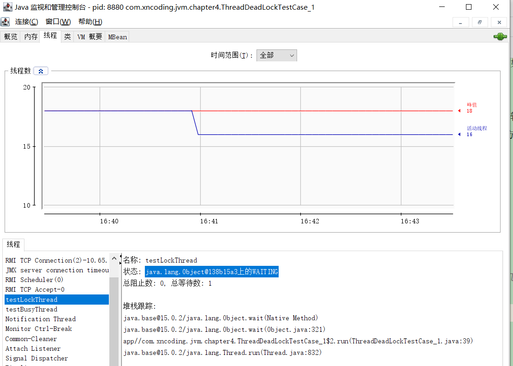
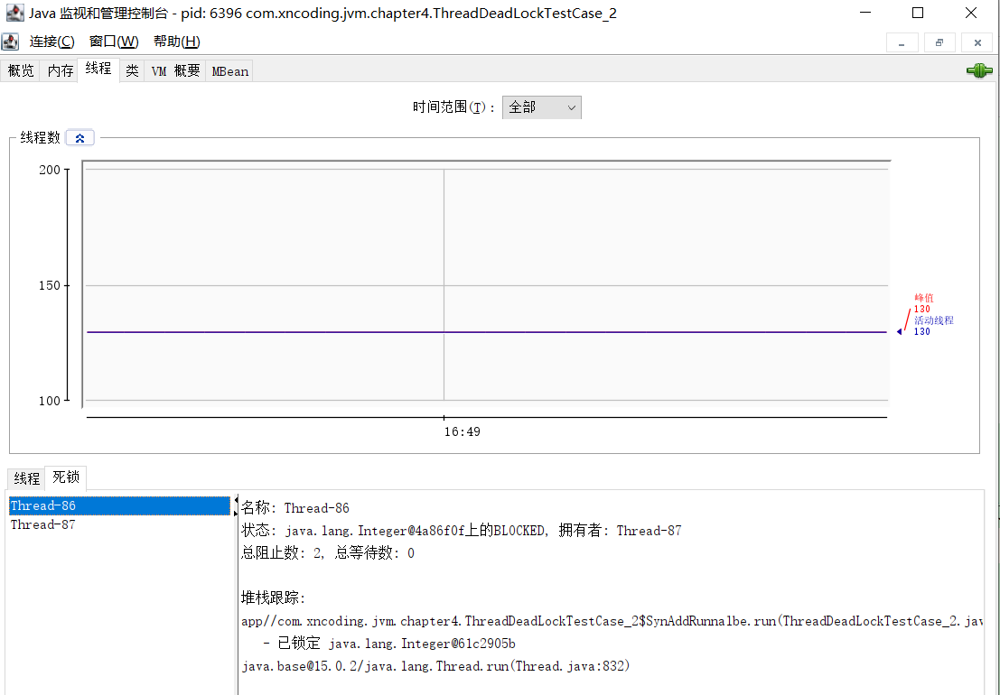

# JVM工具-可视化工具JConsole
JConsole是一款基于JMX的可视化监控和管理工具，它主要功能是通过JMX的MBean对系统进行信息收集和参数动态调整。
JMX是一种开放性的技术，不仅可以用于虚拟机本身管理，还可以运行于虚拟机上的软件中，很多中间件都通过JMX实现监控管理。

## 使用方法
通过在cmd命令行中输入jconsole即可启动JConsole，它会自动搜索出本机运行的所有虚拟机进程，无需使用jps查询。
也可以使用下面的远程进程来连接远程服务器，对远程虚拟机进行监控。



测试代码如下
``` java
public class JConsoleTestCase {
    /**
     * 内存占位符对象，一个OOMObject大约占64K
     */
    static class OOMObject {
        public byte[] placeholder = new byte[64 * 1024];
    }
    public static void fillHeap(int num) throws InterruptedException {
        List<OOMObject> list = new ArrayList<OOMObject>();
        for (int i = 0; i < num; i++) {
            // 稍作延时，令监视曲线的变化更加明显
            Thread.sleep(50);
            list.add(new OOMObject());
        }
        System.gc();
    }
    public static void main(String[] args) throws Exception {
        fillHeap(1000);
    }
}
```

### 概述页签
运行程序后，选中这个进程点击连接，即可打开JConsole主页面如下：


概述里面显示的是整个虚拟机主要运行数据的概览信息，包括堆内存使用情况、线程、类、CPU使用情况四项的整体曲线图。
这些信息是后面几个页签的信息汇总。

### 内存监控
内存页签作用相当于可视化的jstat命令，用于监视被收集器管理的虚拟机内存（Java堆和方法区）的变化趋势。


### 线程监控
如果说JConsole的内存页签相当于可视化jstat命令的话，那线程页签就相当于可视化jstack命令了。
遇到线程停顿的时候可使用这个页签分析，线程长时间停顿主要原因是有等待外部资源（数据库连接、网络连接、设备资源）、
死循环、锁等待之类。下面是测试代码
``` java
public class ThreadDeadLockTestCase_1 {
    /**
     * 线程死循环演示
     */
    public static void createBusyThread() {
        Thread thread = new Thread(new Runnable() {
            @Override
            public void run() {
                while (true)   // 第41行
                    try {
                        Thread.sleep(100L);
                    } catch (InterruptedException e) {
                        e.printStackTrace();
                    }
            }
        }, "testBusyThread");
        thread.start();
    }

    /**
     * 线程锁等待演示
     */
    public static void createLockThread(final Object lock) {
        Thread thread = new Thread(new Runnable() {
            @Override
            public void run() {
                synchronized (lock) {
                    try {
                        lock.wait();
                    } catch (InterruptedException e) {
                        e.printStackTrace();
                    }
                }
            }
        }, "testLockThread");
        thread.start();
    }

    public static void main(String[] args) throws Exception {
        createBusyThread();
        Object obj = new Object();
        createLockThread(obj);
        BufferedReader br = new BufferedReader(new InputStreamReader(System.in));
        br.readLine();
        br.readLine();
    }
}
```
执行程序后，运行jconsole选择线程标签页进入线程监控界面。选择main线程显示如下：


堆栈追踪显示BufferedReader的readBytes()方法正在等待System.in的键盘输入，
这时候的线程状态为Runnable状态，仍然会被分配运行时间，但是readBytes()方法检测到流没有更新就会立刻释放执行权，
这种等待消耗CPU非常小。

接着监控testBusyThread线程如下：


代码中有`Thread.sleep()`语句，因此线程此时处于TIMED_WAITING状态。

最后监控testLockThread线程，在登录lock对象的`notify()`或`notifyAll()`方法的出现。
线程此时处于WAITING状态。


testLockThread线程正处于正常的活锁等待中，只要lock对象的`notify()`或`notifyAll()`方法被调用，
这个线程便能激活继续执行。

### 死锁检测
测试代码如下
``` java
public class ThreadDeadLockTestCase_2 {
    /**
     * 线程死锁等待演示
     */
    static class SynAddRunnalbe implements Runnable {
        int a, b;

        public SynAddRunnalbe(int a, int b) {
            this.a = a;
            this.b = b;
        }

        @Override
        public void run() {
            synchronized (Integer.valueOf(a)) {
                synchronized (Integer.valueOf(b)) {
                    System.out.println(a + b);
                }
            }
        }
    }
    public static void main(String[] args) {
        for (int i = 0; i < 100; i++) {
            new Thread(new SynAddRunnalbe(1, 2)).start();
            new Thread(new SynAddRunnalbe(2, 1)).start();
        }
    }
}
```
如果代码中检测到死锁，点击这里的检测死锁就能检查出来。会新出现一个死锁的页签。


在图中很明显看出来，Threa-86在等待一个被线程Thread-87持有的Integer对象。
而点击Thread-87则显示它在等待一个被线程Thread-86持有的Integer对象，这样两个线程互相卡住了。

