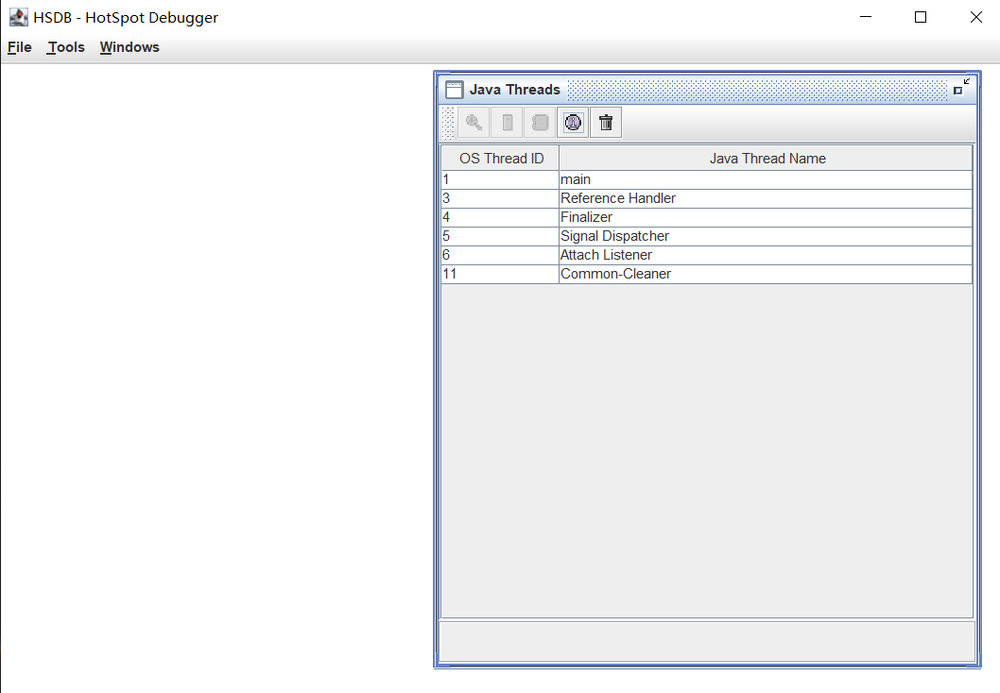
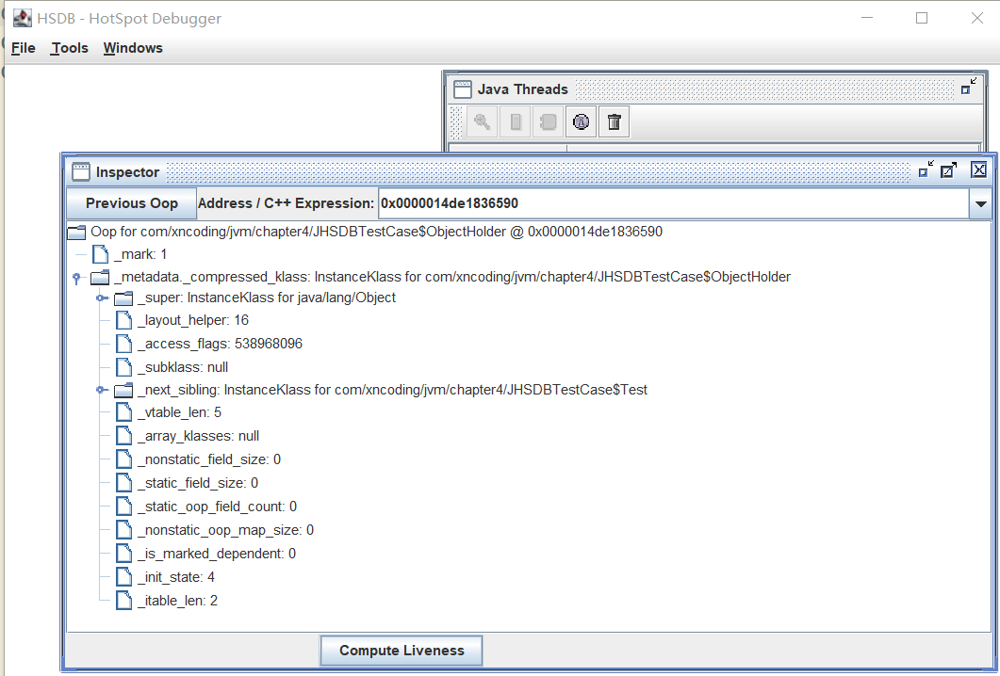

# JVM工具-可视化工具JHSDB

JHSDB是一款基于服务性代理实现的进程外调试工具。可以在一个独立的JVM进程里分析其他HotSpot虚拟机内部数据。
或者从HotSpot虚拟机进程内存中dump出来的转储快照里还原它的运行状态细节。

该工具从JDK9的时候开始提供，随JDK一起发布，无需另外下载。

## 使用方法
接下来通过一个实验来演示JHSDB使用方法，
实验目的是为了找出如下代码中staticObj、instanceObj、localObj三个变量存放的内存地址在哪。

```java
/**
 * staticObj、instanceObj、localObj存放在哪里？
 */
public class JHSDBTestCase {

    static class Test {
        static ObjectHolder staticObj = new ObjectHolder();
        ObjectHolder instanceObj = new ObjectHolder();

        void foo() {
            ObjectHolder localObj = new ObjectHolder();
            System.out.println("done");    // 这里设一个断点
        }
    }

    private static class ObjectHolder {
    }

    public static void main(String[] args) {
        Test test = new Test();
        test.foo();
    }
}
```

我们都知道，静态变量staticObj随着Test的类型信息存放在方法区，instanceObj随着Test对象实例存放在Java堆，
localObject则存放在foo()方法栈帧的局部变量表中。

采用如下的JVM参数来运行这个程序，通过debug方式执行，断点打到注释那行。
```
-Xmx10m -XX:+UseSerialGC -XX:-UseCompressedOops
```

然后通过jps查询进程ID号：
```
C:\Users\xiongneng>jps -l
15840 jdk.jcmd/sun.tools.jps.Jps
9612 com.xncoding.jvm.chapter4.JHSDBTestCase
```

使用如下的命令进入JHSDB图形化模式，指定pid为上面的9612：
```
jhsdb hsdb --pid 9612
```



程序中创建了3个ObjectHolder对象，现在我们要找的是这3个对象的引用存放在哪。我们指定对象都是在堆上创建的。
那么可以先从Java堆里面把这3个对象找到。

点击菜单中的Tools > Heap Parameters，结果如下。由于使用了Serial收集器，便是典型的分代内存布局。
列出了新生代的Eden、S1、S1和老年代的容量（单位字节）以及它们虚拟内存起止范围。


然后点击Windows > Console窗口，使用scanoops命令在Java堆的新生代（Eden起始地址到To Survivor结束地址）范围内查找ObjectHolder的实例。
注意输入类名的时候需要输入包含包名的全称。


再使用Tools > Inspector功能确认这三个地址中存放的对象。结果如下



Inspector为我们展示了对象头和指向对象元数据的指针，里面包含Java类名、继承关系、实现接口、字段信息、方法信息、
运行时常量池的指针、内嵌虚方法表以及接口方法表等。

接着根据堆中对象实例地址找到引用它们的指针，还是打开Windows > Console窗口，输入如下命令
```
hsdb> revptrs 0x0000014de18365c8
Oop for java/lang/Class @ 0x0000014de1834d48
```
然后继续通过Inspector查看这个对象


