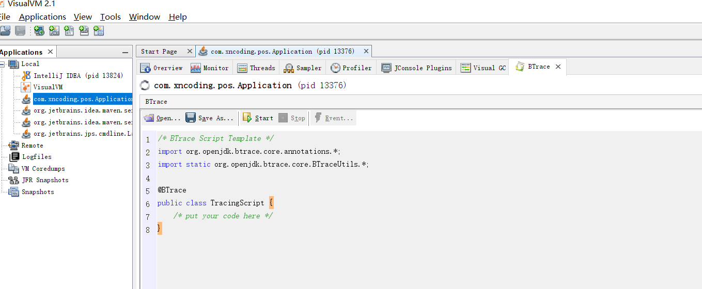

# JVM工具-可视化工具VisualVM
VisualVM是功能最强大的运行监控和故障处理工具之一，曾经很长一段时间是Oracle官方主力发展的虚拟机故障处理工具。
它除了常规的运行监视、故障处理外，还提供性能分析（Profiling）。VisualVM不需要被监视程序基于特殊Agent去运行，
因此它的通用性极强，对应用程序实际性能影响很小，使得它能直接应用在生产环境中。

从JDK9开始，不再打包到JDK中，需要单独下载。

## 使用方法
VisualVM基于NetBeans平台开发，具备通过插件扩展功能的能力，可以做到

1. 显示虚拟机进程以及进程的配置、环境信息。
2. 监视应用程序的处理器、垃圾收集、堆、方法区以及线程的信息。
3. dump以及分析堆转储快照能力。
4. 方法级程序性能分析，找出被调用最多、运行时间最长的方法。
5. 离线程序快照：收集程序的运行时配置、线程dump、内存dump等信息建立一个快照，将快照导出。
6. 其他扩展插件带来的无限可能性。

官方下载地址：<https://visualvm.github.io/download.html>

下载后，解压后。修改下`/etc/visualvm.conf`文件，将`visualvm_jdkhome=`修改成本机JDK目录地址即可。
双击bin目录下的visualvm.exe即可运行。

初次启动时并未加载任何插件，所以第一步肯定是安装插件。安装插件可以手动也可以自动安装。
推荐在网络环境下，通过点击工具 > 插件菜单，弹出插件页签，在里面的可用插件以及已安装中都有。

选择一个需要监视的程序进入程序主界面。


### 生成、浏览堆转储快照
在应用程序窗口双击某个进程后，点击Monitor页签，然后点击Heap Dump即可生成dump文件。
生成后会在该堆的应用程序下增加一个以[heap-dump]开头的子节点，并在主页签中打开该转储快照。
如果想要把dump文件导出，则点击另存为即可。


在Summary标签页看到应用程序dump的运行时参数、System.getProperties()内容、线程堆栈等信息。
切换至Objects标签可查看所有对象的信息。OQL是对象查询语句，需要下载对应插件。Threads标签查看线程信息。

### 分析程序性能
在Profiler页签中，VisualVM提供了程序运行期方法级的处理器执行时间分析以及内存分析。
一般不会在生产环境使用这项功能，或者改用JMC来完成。

要开始性能分析，选择CPU和内存按钮中的一个，然后切换到应用程序中对程序进行操作，
VisualVM会记录这段时间内应用程序执行过的所有方法。如果是进行处理器执行时间分析，
将会统计每个方法执行次数、执行耗时；如果是内存分析，则会统计每个方法关联的对象数以及占用空间。
监控结束后，点击停止按钮即可。


### BTrace动态日志跟踪
BTrace是一个很神奇的VisualVM插件，它本身也是一个可运行的独立程序。
其作用是在不中断目标程序运行前提下，通过HotSpot虚拟机的Instrument功能动态增加原本不存在的调试代码。
这项功能在实际生产环境中非常有用，当生产环境中程序出现问题，排错时又忘记打印日志了。
这时候不需要在源码中添加日志，然后发包，再替换、重启服务。可在运行期间就加入日志代码解决问题。

安装完BTrace插件后，在应用查询面板中右键点击要调试的应用查询，会出现Trace Application的菜单。
点击后进入BTrace面板。这个面板看上去就是一个简单额Java程序开发环境，里面甚至还有一小段代码。


比如我的演示程序的API接口中会调用如下的代码
```java
private void sleep(int time) {
    try {
        System.out.println("start to do task");
        Thread.sleep(time);
    } catch (InterruptedException e) {
        e.printStackTrace();
    }
}
```
现在我想知道传入的参数time的值是什么。下面是TracingScript脚本代码
```java
/* BTrace Script Template */
import org.openjdk.btrace.core.annotations.*;
import static org.openjdk.btrace.core.BTraceUtils.*;

@BTrace
public class TracingScript {
    @OnMethod(clazz="com.xncoding.pos.controller.UserController",
    method="sleep",
    location=@Location(Kind.RETURN))
    public static void func(@Self com.xncoding.pos.controller.UserController instance, int time) {
        println("调用堆栈");
        // jstack();
        println(strcat("方法入参time=", str(time)));
        // 强烈建议加上，否则会因为输出缓冲看不到最新打印结果
        println("==========================");
    }
}
```

点击Start按钮后稍等片刻，出现Done表示成功。当程序运行时，这里output就会打印调试信息。


BTrace用途很广泛，打印调用堆栈、参数、返回值只是最基本的，在它网站上有性能监视、定位连接泄露、内存泄露、
解决多线程竞争问题等使用案例，可去它的官网了解。

BTrace能实现动态修改程序行为，是因为它基于Java虚拟机的Instrument开发的。Instrument是JVM工具接口的重要组件。
提供了一套代理机制，是的第三方工具程序可以代理方式访问和修改Java虚拟机内部的数据，
阿里巴巴可以的诊断工具Arthas也是通过Instrument实现了跟BTrace类似的功能。

