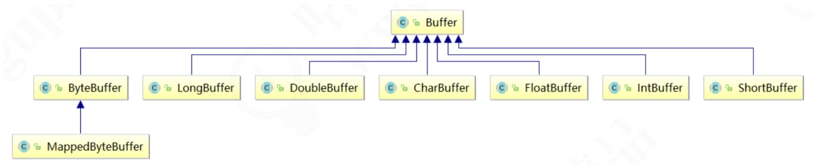
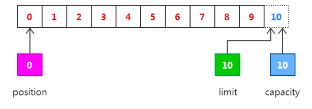
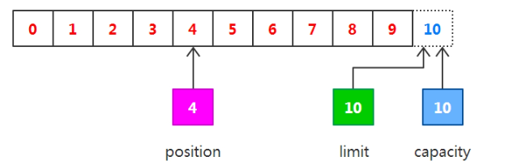
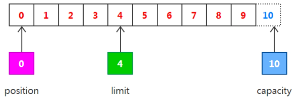
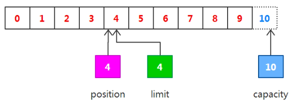
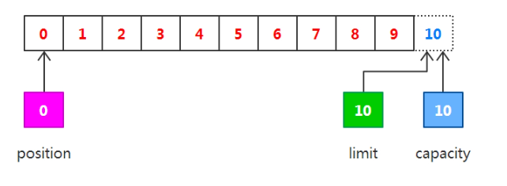
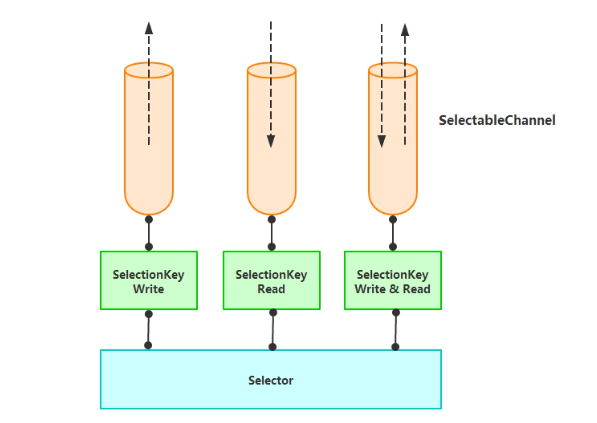
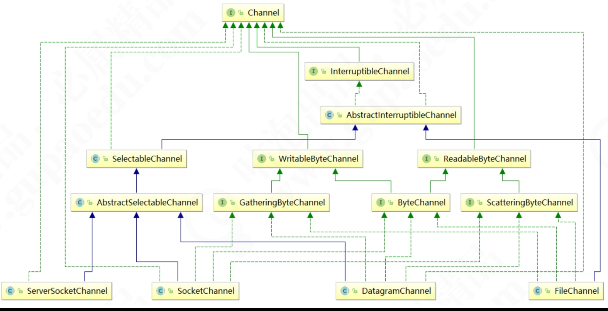

# NIO的核心知识整理

在NIO中有三个核心对象需要掌握：缓冲区（Buffer）、选择器（Selector）和通道（Channel）。

## Buffer

缓冲区实际上是一个容器对象，更直接地说，其实就是一个数组，在NIO库中，所有数据都是用缓冲区处理的。
在读取数据时，它是直接读到缓冲区中的；在写入数据时，它也是写入缓冲区的；任何时候访问NIO中的数据，
都是将它放到缓冲区中。而在面向流I/O系统中，所有数据都是直接写入或者直接将数据读取到Stream对象中。

在NIO中，所有的缓冲区类型都继承于抽象类Buffer，最常用的就是ByteBuffer，对于Java中的基本类型，
基本都有一个具体Buffer类型与之相对应，它们之间的继承关系如下图所示。



我们说缓冲区对象本质上是一个数组，但它其实是一个特殊的数组，缓冲区对象内置了一些机制，能够跟踪和记录缓冲区的状态变化情况，
如果我们使用get()方法从缓冲区获取数据或者使用put()方法把数据写入缓冲区，都会引起缓冲区状态的变化。
在缓冲区中，最重要的属性有下面三个，它们一起合作完成对缓冲区内部状态的变化跟踪。

* position：指定下一个将要被写入或者读取的元素索引，它的值由get()/put()方法自动更新，在新创建一个Buffer对象时，position被初始化为0。
* limit：指定还有多少数据需要取出（在从缓冲区写入通道时），或者还有多少空间可以放入数据（在从通道读入缓冲区时）。
* capacity：指定了可以存储在缓冲区中的最大数据容量，实际上，它指定了底层数组的大小，或者至少是指定了准许我们使用的底层数组的容量。
* mark：记录上一次 postion 的位置，默认是 0，算是一个便利性的考虑，往往不是必须的。

属性值之间有一些相对大小的关系：0<=position<=limit<=capacity。如果我们创建一个新的容量大小为10的ByteBuffer对象，
在初始化的时候，position设置为0，limit和capacity设置为10，在以后使用ByteBuffer对象过程中，capacity的值不会再发生变化，
而其他将会随着使用而变化。

### Buffer常用操作

1. 我们创建了一个 ByteBuffer，准备放入数据，capcity 当然就是缓冲区大小，而 position 就是 0，limit 默认就是 capcity 的大小。
2. 当我们写入几个字节的数据时，position 就会跟着水涨船高，但是它不可能超过 limit 的大 小。
3. 如果我们想把前面写入的数据读出来，需要调用 `flip()` 方法，将 position 设置为 0，limit 设置为以前的 position 那里。
4. 如果还想从头再读一遍，可以调用 `rewind()`，让 limit 不变，position 再次设置为 0。
5. 一旦读完Buffer中的数据，需要让Buffer准备好再次被写入。可以通过`clear()`或`compact()`方法来完成。
`clear()`会将position设回0，limit被设置成capacity的值。而`compact()`将所有未读的数据拷贝到Buffer起始处，
然后将position设到最后一个未读元素正后面，limit属性依然像clear()方法一样，设置成capacity。
6. 通过调用`mark()`方法标记Buffer中的一个特定position。之后可以通过调用`reset()`方法恢复到这个position。

准备一个text.txt文档，输入内容`Test`。然后我们用一段代码来验证position、limit和capacity这三个值的变化过程，代码如下。
```java
package com.xncoding.netty.nio.buffer;

import java.io.FileInputStream;
import java.nio.*;
import java.nio.channels.*;

public class BufferDemo {

    public static void main(String[] args) throws Exception {
        //这用用的是文件IO处理
        FileInputStream fin = new FileInputStream("D://test.txt");
        //创建文件的操作管道
        FileChannel fc = fin.getChannel();

        //分配一个10个大小缓冲区，说白了就是分配一个10个大小的byte数组
        ByteBuffer buffer = ByteBuffer.allocate(10);
        output("初始化", buffer);

        //先读一下
        fc.read(buffer);
        output("调用read()", buffer);

        //准备操作之前，先锁定操作范围
        buffer.flip();
        output("调用flip()", buffer);

        //判断有没有可读数据
        while (buffer.remaining() > 0) {
            byte b = buffer.get();
            // System.out.print(((char)b));
        }
        output("调用get()", buffer);

        //可以理解为解锁
        buffer.clear();
        output("调用clear()", buffer);

        //最后把管道关闭
        fin.close();
    }

    //把这个缓冲里面实时状态给答应出来
    public static void output(String step, ByteBuffer buffer) {
        System.out.println(step + " : ");
        //容量，数组大小
        System.out.print("capacity: " + buffer.capacity() + ", ");
        //当前操作数据所在的位置，也可以叫做游标
        System.out.print("position: " + buffer.position() + ", ");
        //锁定值，flip，数据操作范围索引只能在position - limit 之间
        System.out.println("limit: " + buffer.limit());
    }
}
```

输出结果如下
```
初始化 : 
capacity: 10, position: 0, limit: 10
调用read() : 
capacity: 10, position: 4, limit: 10
调用flip() : 
capacity: 10, position: 0, limit: 4
调用get() : 
capacity: 10, position: 4, limit: 4
调用clear() : 
capacity: 10, position: 0, limit: 10
```

我们已经看到运行结果，下面对以上结果进行图解，三个属性值分别如下图所示。



我们可以从通道中读取一些数据到缓冲区中，注意从通道读取数据，相当于往缓冲区写入数据。如果读取4个自己的数据，则此时position的值为4，
即下一个将要被写入的字节索引为4，而limit仍然是10，如下图所示。



下一步把读取的数据写入输出通道，相当于从缓冲区中读取数据，在此之前，必须调用`flip()`方法。
该方法将会完成以下两件事情：一是把limit设置为当前的position值。二是把position设置为0。

由于position被设置为0，所以可以保证在下一步输出时读取的是缓冲区的第一个字节，而limit被设置为当前的position，
可以保证读取的数据正好是之前写入缓冲区的数据，如下图所示。



现在调用`get()`方法从缓冲区中读取数据写入输出通道，这会导致position的增加而limit保持不变，但position不会超过limit的值，
所以在读取之前写入缓冲区的4字节之后，position和limit的值都为4，如下图所示。



在从缓冲区中读取数据完毕后，limit的值仍然保持在调用`flip()`方法时的值，调用`clear()`方法能够把所有的状态变化设置为初始化时的值，如下图所示。



默认Buffer是堆内内存，也可创建堆外直接内存DirectBuffer。

### 内存映射

内存映射是一种读和写文件数据的方法，可以比常规的基于流或者基于通道的I/O快得多。内存映射文件I/O通过使文件中的数据表现为内存数组的内容来完成，
这初听起来似乎不过就是将整个文件读到内存中，但事实上并不是这样的。一般来说，只有文件中实际读取或写入的部分才会映射到内存中。来看下面的示例代码

```java
package com.xncoding.netty.nio.buffer;

import java.io.*;
import java.nio.*;
import java.nio.channels.*;

/**
 * IO映射缓冲区
 */
public class MappedBuffer {
    static private final int start = 0;
    static private final int size = 26;

    static public void main(String[] args) throws Exception {
        RandomAccessFile raf = new RandomAccessFile("D://test.txt", "rw");
        FileChannel fc = raf.getChannel();

        //把缓冲区跟文件系统进行一个映射关联
        //只要操作缓冲区里面的内容，文件内容也会跟着改变
        MappedByteBuffer mbb = fc.map(FileChannel.MapMode.READ_WRITE, start, size);

        mbb.put(0, (byte) 97);  //a
        mbb.put(25, (byte) 122);   //z

        raf.close();
    }
}
```

## Selector
NIO中非阻塞I/O采用了基于Reactor模式的工作方式，I/O调用不会被阻塞，而是注册感兴趣的特定I/O事件，如可读数据到达、新的套接字连接等，
在发生特定事件时，系统再通知我们。NIO中实现非阻塞I/O的核心对象是Selector，Selector是注册各种I/O事件的地方，而且当那些事件发生时，
就是Seleetor告诉我们所发生的事件，如下图所示。



当有读或写等任何注册的事件发生时，可以从Selector中获得相应的SelectionKey，
同时从SelectionKey中可以找到发生的事件和该事件所发生的具体的SelectableChannel，以获得客户端发送过来的数据。
使用NIO中非阻塞I/O编写服务器处理程序，大体上可以分为下面三个步骤。

1. 向Selector对象注册感兴趣的事件。
2. 从Selector中获取感兴趣的事件。
3. 根据不同的事件进行相应的处理。

首先向Selector注册感兴趣事件
```
//创建selector对象
selector = Selector.open();

// 创建通道
ServerSocketChannel server = ServerSocketChannel.open();
// 设置为非阻塞。BIO升级版本NIO，为了兼容BIO，NIO模型默认是采用阻塞式
server.configureBlocking(false);
// 绑定通道到指定端口号IP/Port
server.bind(new InetSocketAddress(this.port));

// 向selector注册感兴趣事件
server.register(selector, SelectionKey.OP_ACCEPT);
```

上述代码中先创建了ServerSocketChannel对象，并调用configureBlocking()方法，配置为非阻塞模式。接下来的三行代码把该通道绑定到指定端口，
最后向Selector注册事件。此处指定的参数是OP_ACCEPT，即指定想要监听accept事件，也就是新的连接发生时所产生的事件。
对于ServerSocketChannel通道来说，我们唯一可以指定的参数就是OP_ACCEPT。从Selector中获取感兴趣的事件，即开始监听，进入内部循环。

```
public void listen() {
    System.out.println("listen on " + this.port + ".");
    try {
        //轮询主线程
        while (true) {
            // 该方法会阻塞直到有一个事件发生
            selector.select();
            Set<SelectionKey> keys = selector.selectedKeys();
            Iterator<SelectionKey> iter = keys.iterator();
            while (iter.hasNext()) {
                SelectionKey key = iter.next();
                iter.remove();
                //每一个key代表一种状态。数据就绪、数据可读、数据可写 等等
                process(key);
            }
        }
    } catch (IOException e) {
        e.printStackTrace();
    }
}
```

在非阻塞I/O中，内部循环模式基本都遵循这种方式。首先调用select()方法，该方法会阻塞，直到至少有一个事件发生，
然后使用selectedKeys()方法获取发生事件的SelectionKey，再使用迭代器进行循环。

最后一步就是根据不同的事件，编写相应的处理代码。
```
//每一次轮询就是调用一次process方法，而每一次调用，只能干一件事
//在同一时间点，只能干一件事
private void process(SelectionKey key) throws IOException {
    //针对于每一种状态给一个反应
    if (key.isAcceptable()) {
        ServerSocketChannel server = (ServerSocketChannel) key.channel();
        //这个方法体现非阻塞，不管你数据有没有准备好
        //你给我一个状态和反馈
        SocketChannel channel = server.accept();
        //一定一定要记得设置为非阻塞
        channel.configureBlocking(false);
        //当数据准备就绪的时候，将状态改为可读
        key = channel.register(selector, SelectionKey.OP_READ);
    } else if (key.isReadable()) {
        //key.channel 从多路复用器中拿到客户端的引用
        SocketChannel channel = (SocketChannel) key.channel();
        int len = channel.read(buffer);
        if (len > 0) {
            buffer.flip();
            String content = new String(buffer.array(), 0, len);
            key = channel.register(selector, SelectionKey.OP_WRITE);
            //在key上携带一个附件，一会再写出去
            key.attach(content);
            System.out.println("读取内容：" + content);
        }
    } else if (key.isWritable()) {
        SocketChannel channel = (SocketChannel) key.channel();

        String content = (String) key.attachment();
        channel.write(ByteBuffer.wrap(("输出：" + content).getBytes()));

        channel.close();
    }
}
```

## Channel

通道是一个对象，通过它可以读取和写入数据，当然所有数据都通过Buffer对象来处理。我们永远不会将字节直接写入通道，
而是将数据写入包含一个或者多个字节的缓冲区。同样也不会直接从通道中读取字节，而是将数据从通道读入缓冲区，再从缓冲区获取这个字节。

NIO提供了多种通道对象，所有的通道对象都实现了Channel接口。它们之间的继承关系如下图所示。



使用NIO读取数据可以分为下面三个步骤。

1. 从FileInputStream获取Channel。
2. 创建Buffer。
3. 将数据从Channel读取到Buffer中。

下面是一个简单的使用NIO从文件中读取数据的例子。
```java
/**
 * 读文件
 *
 * @author XiongNeng
 * @since 1.0.0
 */
public class FileInputDemo {
    static public void main(String[] args) throws Exception {
        FileInputStream fin = new FileInputStream("D://test.txt");
        // 获取通道
        FileChannel fc = fin.getChannel();
        // 创建缓冲区
        ByteBuffer buffer = ByteBuffer.allocate(1024);
        // 读取数据到缓冲区
        fc.read(buffer);
        buffer.flip();
        while (buffer.remaining() > 0) {
            byte b = buffer.get();
            System.out.print(((char) b));
        }
        fin.close();
    }
}
```

使用NIO写入数据与读取数据的过程类似，数据同样不是直接写入通道的，而是写入缓冲区，可以分为下面三个步骤。

1. 从FileOutputStream获取Channel。
2. 创建Buffer。
3. 将数据从Channel写入Buffer。

```java
/**
 * 写文件
 *
 * @author XiongNeng
 * @since 1.0.0
 */
public class FileOutputDemo {
    static private final byte[] message = {83, 111, 109, 101, 32, 98, 121, 116, 101, 115, 46};
    static public void main(String[] args) throws Exception {
        FileOutputStream fout = new FileOutputStream("D://test.txt");
        FileChannel fc = fout.getChannel();
        ByteBuffer buffer = ByteBuffer.allocate(1024);
        for (byte b : message) {
            buffer.put(b);
        }
        buffer.flip();
        fc.write(buffer);
        fout.close();
    }
}
```

