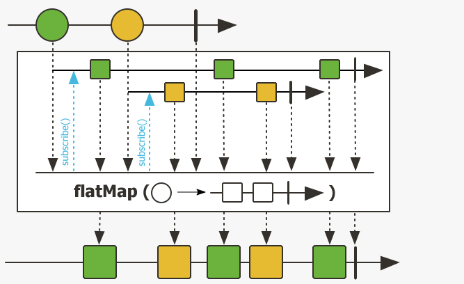
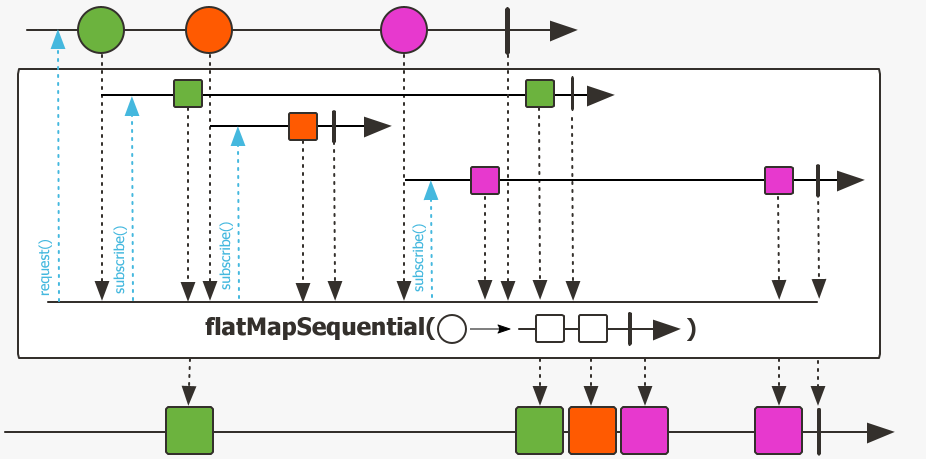
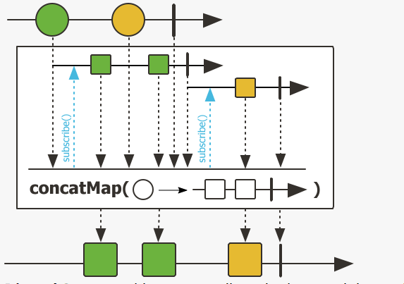

# Reactor11-数据扁平处理flatMap

在Stream中我们可以通过flatMap将多维数据打开降维，扁平化处理数据为一维数据。Reactor当然也有这种需求，
我们可以使用flatMap和concatMap进行数据的降维处理。

**flatMap示意图**



**flatMapSequential示意图**



**concatMap示意图**



根据示意图可以清楚的看出这三个方法的异同：

* flatMap和flatMapSequential的订阅是同时进行的，而concatMap的是有先后顺序的。
* concatMap和flatMapSequential的值是跟源中值顺序相同，其中flatMapSequential是经过后排序，二者输出相同。
* flatMap中的值是交错的，根据事件触发。

测试代码如下

```java
@Slf4j
public class FlatMapDemo {
    /**
     * 输出
     * ->a->e->b->c->f->g->d->h
     *
     * @throws InterruptedException exception
     */
    public void flatMap() throws InterruptedException {
        Flux.just("abcd", "efgh")
                .flatMap(i -> Flux.fromArray(i.split("")).delayElements(Duration.ofMillis(10)))
                .subscribe(i -> System.out.print("->" + i));
        Thread.sleep(100);
    }

    /**
     * 输出 ->a->b->c->d->e->f->g->h
     *
     * @throws InterruptedException exception
     */
    public void flatMapSequential() throws InterruptedException {
        Flux.just("abcd", "efgh")
                .flatMapSequential(i -> Flux.fromArray(i.split("")).delayElements(Duration.ofMillis(10)))
                .subscribe(i -> System.out.print("->" + i));
        Thread.sleep(100);
    }

    /**
     * 输出 ->a->b->c->d->e->f->g->h
     */
    public void flatMapIterable() {
        Flux.just("abcd", "efgh")
                .flatMapIterable(i -> Arrays.asList(i.split("")))
                .subscribe(i -> System.out.print("->" + i));
    }

    /**
     * 输出
     * ->a->b->c->d->e->f->g->h
     *
     * @throws InterruptedException exception
     */
    public void concatMap() throws InterruptedException {
        Flux.just("abcd", "efgh")
                .concatMap(i -> Flux.fromArray(i.split("")).delayElements(Duration.ofMillis(10)))
                .subscribe(i -> System.out.print("->" + i));
        Thread.sleep(110);
    }

    /**
     * 输出
     * ->a->b->c->d->e->f->g->h
     */
    public void concatMapIterable() {
        Flux.just("abcd", "efgh")
                .concatMapIterable(i -> Arrays.asList(i.split("")))
                .subscribe(i -> System.out.print("->" + i));
    }
}
```

