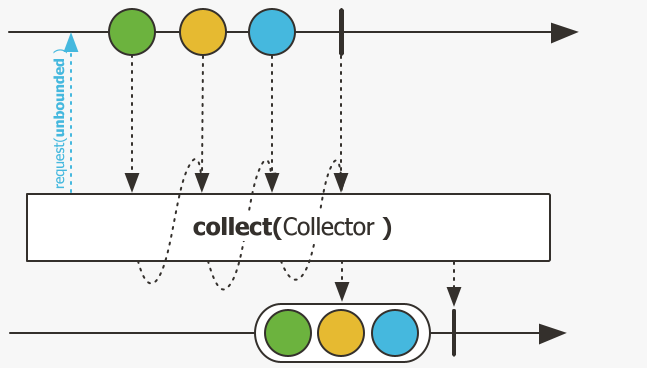
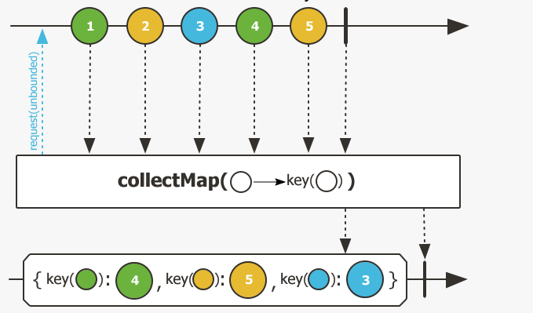
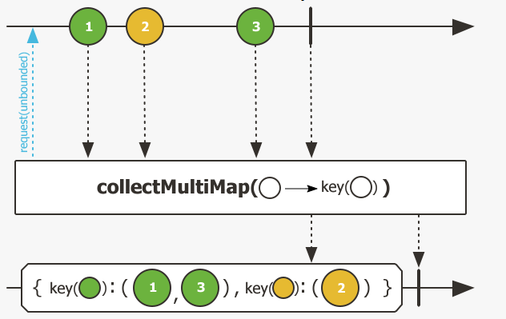

# Reactor13-数据收集collect

有的时候流数据有需要转化为其他类型数据，同Stream相同，Reactor也有将数据进行收集的方法：

1. collect() : 将数据根据给出的collector进行收集
2. collectList() : 收集收集为list形式
3. collectSortedList(): 数据收集为list并排序，需要给出排序规则
4. collectMap(): 数据收集为Map形式，是key，value形式，因此如果有重复key会覆盖
5. collectMultimap(): 数据收集为Map形式，是key，collection形式，如果有重复key值写在list中

## collect()方法



注意收集后的返回值为Mono对象。示例如下

``` java
public void collectTest() {
    Mono<Set<String>> flux = Flux.just("ffzs", "vincent", "tony", "sleepycate")
            .collect(Collectors.toSet())
            .log();
    flux.subscribe();
}
```

## collectList() 方法

直接收集为`Mono<List<>>`，示例如下

``` java
public void collectListTest() {
    Flux.just("ffzs", "vincent", "tony", "sleepycate")
            .collectList()
            .log()
            .subscribe();
}
```

## collectSortedList()方法

直接收集为`Mono<List<>>`，并且列表为排序后的结果，示例如下

``` java
public void collectSortedListTest() {
    Flux.just("ffzs", "vincent", "tony", "sleepycate")
            .collectSortedList(Comparator.comparing(String::length))
            .log()
            .subscribe();
}
```

## collectMap()方法



根据字符串的长度作为key，相同key会被覆盖掉。

``` java
public void collectMapTest() {
    Flux.just("ffzs", "vincent", "tony", "sleepycate")
            .collectMap(String::length)
            .log()
            .subscribe();
}
```

## collectMultimap()方法



value是一个列表，相同key元素放到同一个列表中。

代码示例如下

``` java
public void collectMultimapTest() {
    Flux.just("ffzs", "vincent", "tony", "sleepycate")
            .collectMultimap(String::length)
            .log()
            .subscribe();
}
```

返回结果如下

```
onNext({4=[ffzs, tony], 7=[vincent], 10=[sleepycate]})
```
