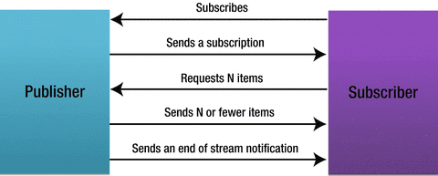

# Reactor14-响应式流规范

现代软件对近乎实时地处理数据的需求越来越强烈，对不断变化的信息的即时响应，意味着更大的商业价值，
流处理是一种快速将数据转换为有用信息的手段。

数据流中的元素可以是一个一个的待计算的数据，也可以是一个一个待响应的事件。前者多用于大数据处理，
比如Storm、Spark等产品，后者常用于响应式编程，比如Netflix在使用的RxJava、
Java开发者都熟悉的Pivotal公司的Project Reactor、走在技术前沿的Vert.x等。

软件行业是一个非常注重分享和交流的行业。随着对响应式编程技术的讨论与沟通逐渐深入，2013年末的时候，
Netflix、Pivotal、Typesafe等公司的工程师们共同发起了关于制定响应式流规范（Reactive Stream Specification）的倡议和讨论，
并在github上创建了reactive-streams-jvm项目。到2015年5月份，1.0版本的规范出炉，项目README就是规范正文。

各个响应式开发库都要遵循这个规范，其好处也是显而易见的。之所以我们编写的Java代码可以在Hotspot、J9和Zing等JVM运行，
是因为它们都遵循Java虚拟机规范。类似的，由于各个响应式开发库都遵循响应式流规范，因此互相兼容，
不同的开发库之间可以进行交互，我们甚至可以同时在项目中使用多个响应式开发库。对于Spring WebFlux来说，也可以使用RxJava作为响应式库。

访问[reactive-streams-jvm](https://github.com/reactive-streams/reactive-streams-jvm)项目，
可以浏览规范的细节，包括其中定义的响应式流的特点：

1. 具有处理无限数量的元素的能力；
2. 按序处理；
3. 异步地传递元素；
4. 必须实现非阻塞的回压（backpressure）。

## 响应式流接口

响应式流规范定义了四个接口，如下：

### Publisher
1、Publisher是能够发出元素的发布者。
``` java
public interface Publisher<T> {
    public void subscribe(Subscriber<? super T> s);
}
```

## Subscriber
2、Subscriber是接收元素并做出响应的订阅者。
``` java
public interface Subscriber<T> {
    public void onSubscribe(Subscription s);
    public void onNext(T t);
    public void onError(Throwable t);
    public void onComplete();
}
```

当执行subscribe方法时，发布者会回调订阅者的onSubscribe方法，这个方法中，通常订阅者会借助传入的Subscription向发布者请求n个数据。
然后发布者通过不断调用订阅者的onNext方法向订阅者发出最多n个数据。如果数据全部发完，则会调用onComplete告知订阅者流已经发完；
如果有错误发生，则通过onError发出错误数据，同样也会终止流。



订阅后的回调用表达式表示就是`onSubscribe -> onNext* -> (onError | onComplete)?`，即以一个onSubscribe开始，
中间有0个或多个onNext，最后有0个或1个onError或onComplete事件。

Publisher和Subscriber融合了迭代器模式和观察者模式。

## Subscription
3、Subscription是Publisher和Subscriber的中间人。
``` java
public interface Subscription {
    public void request(long n);
    public void cancel();
}
```

当发布者调用subscribe方法注册订阅者时，会通过订阅者的回调方法onSubscribe传入Subscription对象，
之后订阅者就可以使用这个Subscription对象的request方法向发布者“要”数据了。回压机制正是基于此来实现的，
因此第4个特点也能够实现了。

## Processor
4、Processor集Publisher和Subscriber于一身。
``` java
public interface Processor<T, R> extends Subscriber<T>, Publisher<R> {
}
```

这四个接口在JEP 266跟随Java 9版本被引入了Java SDK。

这四个接口是实现各开发库之间互相兼容的桥梁，响应式流规范也仅仅聚焦于此，而对诸如转换、合并、分组等等的操作一概未做要求，
因此是一个非常抽象且精简的接口规范。

如果这时候有人要造轮子，再写一套响应式开发库，如何基于这几个接口展开呢？

## 订阅的背后
Reactor 3是遵循响应式流规范的实现，因此，小撸一把Reactor的源码有助于我们理解规范中定义的接口的使用。

Reactor中，我们最先接触的生成Publisher的方法就是Flux.just()。首先Flux是一个Publisher。
``` java
package reactor.core.publisher;

import org.reactivestreams.Publisher;
import org.reactivestreams.Subscriber;

public abstract class Flux<T> implements Publisher<T> {
    public abstract void subscribe(Subscriber<? super T> s);
}
```

在Reactor中，Flux既是一个发布者，又充当工具类的角色，当我们用Flux.just()、Flux.range()或Flux.interval()等工厂方法生成Flux时，
会new一个新的Flux，比如Flux.just会返回一个FluxArray对象。
``` java
public static <T> Flux<T> just(T... data) {
    return new FluxArray<>(data);
}
```

返回的FluxArray对象是Flux.just生成的Publisher，它继承自Flux，并实现了subscribe方法。
``` java
public class FluxArray<T> extends Flux<T> {
    private T[] array;  // 1
    
    public FluxArray(T[] data) {
        this.array = data;
    }

    @Override
    public void subscribe(Subscriber<? super T> actual) {
        actual.onSubscribe(new ArraySubscription<>(actual, array)); // 2
    }
}
```

1. FluxArray内部使用一个数组来保存数据；
2. subscribe方法通常会回调Subscriber的onSubscribe方法，该方法需要传入一个Subscription对象，
从而订阅者之后可以通过回调传回的Subscription的request方法跟FluxArray请求数据，这也是回压的应有之义。

继续编写ArraySubscription
``` java
public class FluxArray<T> extends Flux<T> {
    static class ArraySubscription<T> implements Subscription { // 1
        final Subscriber<? super T> actual;
        final T[] array;    // 2
        int index;
        boolean canceled;

        public ArraySubscription(Subscriber<? super T> actual, T[] array) {
            this.actual = actual;
            this.array = array;
        }

        @Override
        public void request(long n) {
            if (canceled) {
                return;
            }
            long length = array.length;
            for (int i = 0; i < n && index < length; i++) {
                actual.onNext(array[index++]);  // 3
            }
            if (index == length) {
                actual.onComplete();    // 4
            }
        }

        @Override
        public void cancel() {  // 5
            this.canceled = true;
        }
    }
}
```

1. ArraySubscription是一个静态内部类。静态内部类是最简单的一种内部类，你尽可以把它当成普通的类，只不过恰好定义在其他类的内部；
2. 可见在Subscription内也有一份数据；
3. 当有可以发出的元素时，回调订阅者的onNext方法传递元素；
4. 当所有的元素都发完时，回调订阅者的onComplete方法；
5. 订阅者可以使用Subscription取消订阅。

OK，一个简单的Flux.just就完成了，通过这个例子我们能够初步摸出Flux工厂方法的一些“套路”：

* 工厂方法返回的是Flux子类的实例，如FluxArray；
* FluxArray的subscribe方法会返回给订阅者一个Subscription实现类的对象，这个ArraySubscription是FluxArray的静态内部类，
定义了“如何发布元素”的逻辑；
* 订阅者可以通过这个ArraySubscription对象向发布者请求n个数据；
发布者也可以借助这个ArraySubscription对象向订阅者传递数据元素（onNext/onError/onComplete）。

用图来表示如下


上图的这个过程基本适用于大多数的用于生成Flux/Mono的静态工厂方法，如Flux.just、Flux.range等。

首先，使用类似Flux.just的方法创建发布者后，会创建一个具体的发布者（Publisher），如FluxArray。

1. 当使用.subscribe订阅这个发布者时，首先会new一个具有相应逻辑的Subscription（如ArraySubscription，
这个Subscription定义了如何处理下游的request，以及如何“发出数据”）；
2. 然后发布者将这个Subscription通过订阅者的.onSubscribe方法传给订阅者；
3. 在订阅者的.onSubscribe方法中，需要通过Subscription发起第一次的请求.request；
4. Subscription收到请求，就可以通过回调订阅者的onNext方法发出元素了，有多少发多少，但不能超过请求的个数；
5. 订阅者在onNext中通常定义对元素的处理逻辑，处理完成之后，可以继续发起请求；
6. 发布者根据继续满足订阅者的请求；
7. 直至发布者的序列结束，通过订阅者的onComplete予以告知；当然序列发送过程中如果有错误，则通过订阅者的onError予以告知并传递错误信息；
这两种情况都会导致序列终止，订阅过程结束。

以上从1~7这些阶段称为订阅期（subscribe time）。

## 操作符流水线

响应式开发库的一个很赞的特性就是可以像组装流水线一样将操作符串起来，用来声明复杂的处理逻辑。比如：
``` java
Flux ff = Flux.just(1, 2, 3, 4, 5)
    .map(i -> i * i)
    .filter(i -> (i % 2) == 0);
ff.subscribe(...)
```

通过源码，我们可以了解这种“流水线”的实现机制。下面我们仍然是通过照虎画猫的方式模拟一下Reactor中Flux.map的实现方式。

Flux.map用于实现转换，转换后元素的类型可能会发生变化，转换的逻辑由参数Function决定。方法本身返回的是一个转换后的Flux，
基于此，该方法实现如下：
``` java
public abstract class Flux<T> implements Publisher<T> {
    public <V> Flux<V> map(Function<? super T, ? extends V> mapper) {   // 1
        return new FluxMap<>(this, mapper); // 2
    }
}
```

1. 泛型方法，通过泛型表示可能出现的类型的变化（T → V）；
2. FluxMap就是新的Flux。

既然FluxMap是一个新的Flux，那么与上面FluxArray类似，其内部定义有MapSubscription，这是一个Subscription，
能够根据其订阅者的请求发出数据。

```java
public class FluxMap<T, R> extends Flux<R> {

    private final Flux<? extends T> source;
    private final Function<? super T, ? extends R> mapper;

    public FluxMap(Flux<? extends T> source, Function<? super T, ? extends R> mapper) {
        this.source = source;
        this.mapper = mapper;
    }

    @Override
    public void subscribe(Subscriber<? super R> actual) {
        source.subscribe(new MapSubscriber<>(actual, mapper));
    }

    static final class MapSubscription<T, R> implements Subscription {
        private final Subscriber<? super R> actual;
        private final Function<? super T, ? extends R> mapper;

        MapSubscriber(Subscriber<? super R> actual, Function<? super T, ? extends R> mapper) {
            this.actual = actual;
            this.mapper = mapper;
        }
        
        @Override
        public void request(long n) {   // 1
            // TODO 收到请求，发出元素
        }

        @Override
        public void cancel() {
            // TODO 取消订阅
        }
    }
}
```

1、但是map操作符并不产生数据，只是数据的搬运工。收到request后要发出的数据来自上游。

所以MapSubscription同时也应该是一个订阅者，它订阅上游的发布者，并将数据处理后传递给下游的订阅者
（为了跟Reactor源码一致，将MapSubscription改名为MapSubscriber，其实没差）。


如图，对下游是作为发布者，传递上游的数据到下游；对上游是作为订阅者，传递下游的请求到上游。
``` java
static final class MapSubscriber<T, R> implements Subscriber<T>, Subscription {
    private final Subscriber<? super R> actual;
    private final Function<? super T, ? extends R> mapper;

    boolean done;

    Subscription subscriptionOfUpstream;

    MapSubscriber(Subscriber<? super R> actual, Function<? super T, ? extends R> mapper) {
        this.actual = actual;
        this.mapper = mapper;
    }

    @Override
    public void onSubscribe(Subscription s) {
        this.subscriptionOfUpstream = s;    // 1
        actual.onSubscribe(this);           // 2
    }

    @Override
    public void onNext(T t) {
        if (done) {
            return;
        }
        actual.onNext(mapper.apply(t));     // 3
    }

    @Override
    public void onError(Throwable t) { 
        if (done) {
            return;
        }
        done = true;
        actual.onError(t);                  // 4
    }

    @Override
    public void onComplete() {
        if (done) {
            return;
        }
        done = true;
        actual.onComplete();                // 5
    }

    @Override
    public void request(long n) {
        this.subscriptionOfUpstream.request(n);     // 6
    }

    @Override
    public void cancel() {
        this.subscriptionOfUpstream.cancel();       // 7
    }
}
```

1. 拿到来自上游的Subscription；
2. 回调下游的onSubscribe，将自身作为Subscription传递过去；
3. 收到上游发出的数据后，将其用mapper进行转换，然后接着发给下游；
4. 将上游的错误信号原样发给下游；
5. 将上游的完成信号原样发给下游；
6. 将下游的请求传递给上游；
7. 将下游的取消操作传递给上游。

从这个对源码的模仿，可以体会到，当有多个操作符串成“操作链”的时候：

* 向下：很自然地，数据和信号（onSubscribe、onNext、onError、onComplete）是通过每一个操作符向下传递的，
传递的过程中进行相应的操作处理，这一点并不难理解；
* 向上：然而在内部我们看不到的是，有一个自下而上的“订阅链”，这个订阅链可以用来传递request，
因此回压（backpressure）可以实现从下游向上游的传递。

这一节最开头的那一段代码的执行过程如下图所示：


## LambdaSubscriber

subscribe有几个不同方法签名的变种：
``` java
subscribe(Consumer<? super T> consumer) 

subscribe(@Nullable Consumer<? super T> consumer, 
          Consumer<? super Throwable> errorConsumer) 

subscribe(@Nullable Consumer<? super T> consumer,
          @Nullable Consumer<? super Throwable> errorConsumer,
          @Nullable Runnable completeConsumer) 
            
subscribe(@Nullable Consumer<? super T> consumer,
          @Nullable Consumer<? super Throwable> errorConsumer,
          @Nullable Runnable completeConsumer,
          @Nullable Consumer<? super Subscription> subscriptionConsumer)
```

用起来非常方便，但是响应式流规范中只定义了一个订阅方法subscribe(Subscriber subscriber)。
实际上，这几个方法最终都是调用的subscribe(LambdaSubscriber subscriber)，
并通过LambdaSubscriber实现了对不同个数参数的组装。如下图所示：


因此，
``` java
flux.subscribe(System.out::println, System.err::println);
```
其实就是调用
``` java
flux.subscribe(new LambdaSubscriber(System.out::println, System.err::println, null, null));
```

