# 使用PyQt5开发桌面应用

PyQt5工具可以快速实现简单的界面开发，包括界面设计、布局管理以及业务逻辑实现（信号与槽）。
简单说就是使用PyQt5工具可以快速画一个控件摆放整齐、界面整洁有序、布局合理的界面。

## 安装和配置

首先是按照Python环境和配置pip。官网下载最新版本的Python3安装即可。

pip工具镜像源配置。配置方法如下：

1. 在cmd窗口下执行echo %HOMEPATH%获取用户家目录，并在该目录下创建pip目录。
2. 在pip目录下创建pip.ini文件。记住，后缀必须是.ini格式。并在该文件中写入如下内容。

```
[global]
index-url = http://pypi.douban.com/simple
[install]
trusted-host = pypi.douban.com
```

安装PyQt5：

```
pip install PyQt5 -i http://pypi.douban.com/simple/ --trusted-host pypi.douban.com
pip install PyQt5-tools -i http://pypi.douban.com/simple/ --trusted-host pypi.douban.com
```

最新版designer.exe放在C:\Python\Lib\site-packages\qt5_applications\Qt\bin，把它放到桌面快捷方式上。

## PyCharm中PyQt5工具配置

还有一种更推荐方式，就是在PyCharm中集成。打开PyCharm，选择Settings -> Tools -> External Tools，点击左上角的绿色加号。

1）配置Qt Designer，参数配置说明：

* Name：Qt Designer。方便记忆。实际可以任意取值。
* Arguments：designer.exe程序绝对路径。根据实际安装路径填写。
* Working directory: $FileDir$。固定取值。

2）配置PyUIC。该工具是用于将Qt Designer工具开发完成的.ui文件转化为.py文件。配置打开路径同Qt Designer。参数配置说明：

* Name：PyUIC。方便记忆。实际可以任意取值。
* Program：python.exe程序绝对路径。根据实际安装路径填写。
* Arguments：`-m PyQt5.uic.pyuic $FileName$ -o $FileNameWithoutExtension$.py`。固定取值。
* Working directory: $FileDir$。固定取值。

3）配置Pyrcc，用于PyQt5的资源文件转码。参数配置说明：

* Name：Pyrcc。方便记忆。实际可以任意取值。
* Program：python.exe程序绝对路径。根据实际安装路径填写。
* Arguments：`$FileName$ -o $FileNameWithoutExtension$_rc.py`。固定取值。
* Working directory: $FileDir$。固定取值。

退出之前，点击Apply保存配置。配置完成之后，PyCharm中会加入3个工具。点击QtDesigner则打开QtDesigner的界面。
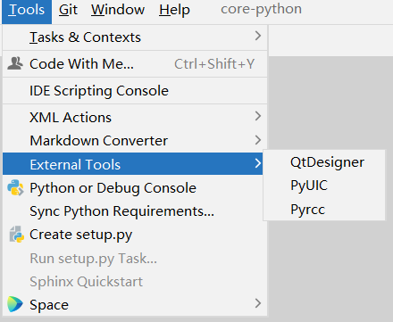

打开后是如下的欢迎界面


创建新的Form给出了5个模板，其中Widget与Main Window最为常用。这里我们选择创建一个Main Window。
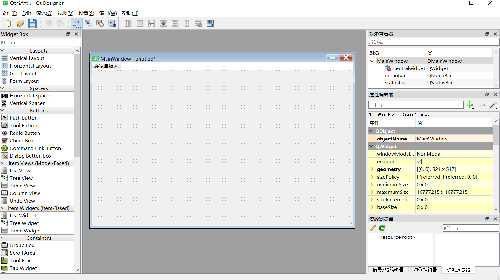

上面界面的最左侧菜单为Widget Box，Widget Box中包含PyQt5中的所有Widget组件，
我们可以从左侧的Widget Box中拖拽出诸如Button、View和Input等组件到中间的窗口中。

点击Form -> Preview（快捷键为Ctrl+R）则可以预览我们设计好的界面， 也可以用Preview In来选择在相应的主题风格下预览。

我们拖拽一个Label与Button进入主窗口（Main Window）。


此时在右上角的Object Inspector（对象查看器）中可以看到主窗口中的已放置的对象（label与pushButton）以及其相应地Qt类。
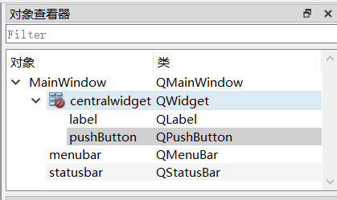

以Label为例，此时我们点击Main Window中的label或是在Object Inspector中选取label后，查看右侧的一块区域——Property Editor（属性编辑器）。


其主要包含属性有如下：

| 名称          | 含义         |
|-------------|------------|
| objectName  | 控件对象名称     |
| geometry    | 相应宽和高与坐标   |
| sizePolicy  | 控件大小的策略    |
| minimumSize | 最小的宽和高     |
| maximumSize | 最大的宽和高     |
| font        | 字体         |
| cursor      | 光标         |

最右下角的部分则为Resource Browser（资源浏览器），资源浏览器中可以添加相应地如图片素材，作为Label或Button等控件的背景图片等。

## Qt Designer的UI文件
使用Qt Designer设计保存的文件为.ui格式的文件。其实质是一个XML文件。ui文件中存放了在主窗口中的一切控件的相关属性。
使用XML文件来存储UI文件，具有高可读性和移植性，因此我们可以方便地将.ui文件转换到.py文件，从而使得我们可以使用Python语言在设计的GUI上面编程。

## 将.ui文件转换为.py文件
将.ui文件转换到.py文件很简单，在前面我们曾设置了pyuic5这个工具。如果你没有在PyCharm中设置这个工具，
或者根本没有使用PyCharm，则可以到命令行中使用如下命令实现.ui到.py的转换。
```
pyuic5 - o 目标文件名.py 源文件名.ui
```

或者直接在PyCharm中，找到.ui文件，右键 打开菜单找到External Tools->PyUIC。点击之后，我们在相应工程目录下会产生一个.py文件。
（注意，.ui文件必须存放在我们的External Tools中设置的相应项目目录下）

转换完成之后，打开.py文件。
```python
# -*- coding: utf-8 -*-

# Form implementation generated from reading ui file 'demo.ui'
#
# Created by: PyQt5 UI code generator 5.15.4
#
# WARNING: Any manual changes made to this file will be lost when pyuic5 is
# run again.  Do not edit this file unless you know what you are doing.


from PyQt5 import QtCore, QtGui, QtWidgets


class Ui_MainWindow(object):
    def setupUi(self, MainWindow):
        MainWindow.setObjectName("MainWindow")
        MainWindow.resize(821, 517)
        self.centralwidget = QtWidgets.QWidget(MainWindow)
        self.centralwidget.setObjectName("centralwidget")
        self.pushButton = QtWidgets.QPushButton(self.centralwidget)
        self.pushButton.setGeometry(QtCore.QRect(300, 240, 93, 28))
        self.pushButton.setObjectName("pushButton")
        self.label = QtWidgets.QLabel(self.centralwidget)
        self.label.setGeometry(QtCore.QRect(300, 180, 72, 15))
        self.label.setObjectName("label")
        MainWindow.setCentralWidget(self.centralwidget)
        self.menubar = QtWidgets.QMenuBar(MainWindow)
        self.menubar.setGeometry(QtCore.QRect(0, 0, 821, 26))
        self.menubar.setObjectName("menubar")
        MainWindow.setMenuBar(self.menubar)
        self.statusbar = QtWidgets.QStatusBar(MainWindow)
        self.statusbar.setObjectName("statusbar")
        MainWindow.setStatusBar(self.statusbar)

        self.retranslateUi(MainWindow)
        QtCore.QMetaObject.connectSlotsByName(MainWindow)

    def retranslateUi(self, MainWindow):
        _translate = QtCore.QCoreApplication.translate
        MainWindow.setWindowTitle(_translate("MainWindow", "MainWindow"))
        self.pushButton.setText(_translate("MainWindow", "PushButton"))
        self.label.setText(_translate("MainWindow", "TextLabel"))
```

观察上述文件，可以看到如果不通过Qt Designer来制作界面的话，我们将会一次次地调试程序，来讲按钮和Label等放在合适的位置，
这将是极其痛苦的过程。而通过Qt Designer，我们可以快速地制作UI，并生成Python的代码，从而实现快速地UI的开发。

## 使用转换的.py文件

然而，此时之间运行这个转换好的Python文件是无法显示任何窗口的。因为这个Python文件只有定义主窗口以及其控件的代码，
并没有程序入口的代码。为了秉持视图与逻辑分离的原则，我们再编写一个新的脚本来调用这个文件，并且创建一个窗口。
``` python
import sys
from PyQt5.QtWidgets import QApplication, QMainWindow
# 下面的demo是转换后的模块名称
from demo import *


class MyWindow(QMainWindow, Ui_MainWindow):
    def __init__(self, parent=None):
        super(MyWindow, self).__init__(parent)
        self.setupUi(self)


if __name__ == '__main__':
    app = QApplication(sys.argv)
    myWin = MyWindow()
    myWin.show()
    sys.exit(app.exec_())
```

通过上述代码，我们继承了Ui_MainWindow类，使用其构造方法构造主窗口，并定义了程序的入口，通过创建QApplication对象来创建Qt窗口。

## 布局管理
Qt Designer中，在工具箱中最上方可以看到有4种布局。分别是垂直布局、水平布局、栅格布局和表单布局。

| 布局名称	           | 布局含义                                    |
|-----------------|-----------------------------------------|
| 垂直（Vertical）布局	 | 布局内的控件按照从上到下的顺序纵向排列                     |
| 水平（Horizontal）  | 布局	布局内的控件按照从左到右的顺序横向排列                  |
| 栅格（Grid）布局	     | 将控件放入栅格中，然后划分成若干行与若干列，并且将每个窗口控件放在合适的单元中 |
| 表单（Form）布局	     | 控件以两列布局在表单中，左列包含标签，右列包含输入控件             |

在Qt Designer中实现布局有两种方式，通过布局管理器进行布局和通过容器控件进行布局。

### 布局管理器
让我们在左侧的工具箱中随意拖动一些诸如按钮、标签、输入框等控件到主窗口中。
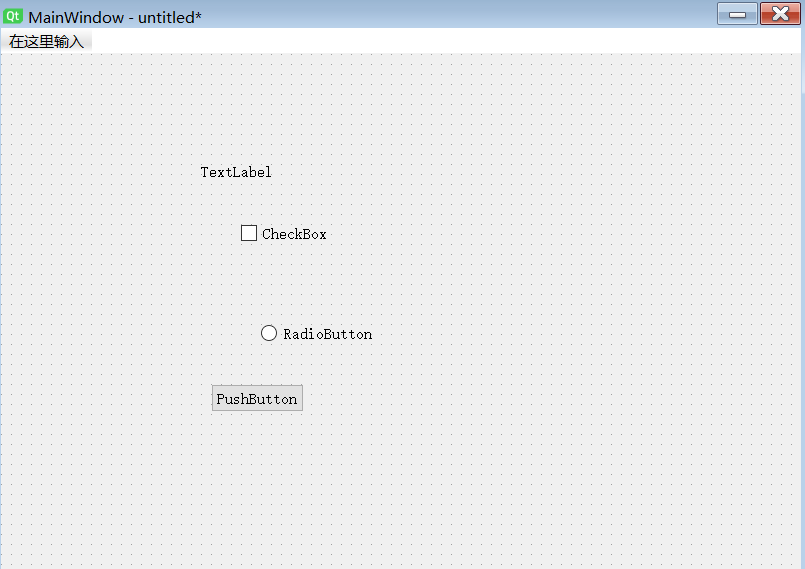

由于刚才是随意拖拽至主窗口，因此所有控件的排放是乱七八糟的。此时，我们不选中任何控件，在空白处点击右键，找到弹出菜单最下方的Layout布局。
这里我们选择垂直布局，整个主窗口内的所有控件一瞬间都垂直着排列整齐了。
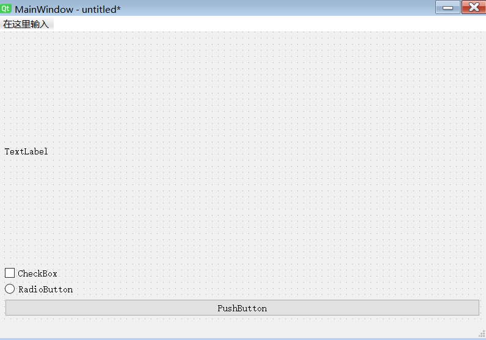

此时如果需要调整垂直布局的顺序，只需按住待调整的控件，上下拖动即可。但是这样布局是针对整个窗口的，
有时我们需要让不同的布局有父子关系的继承。那么这时就不能单纯地在空白的地方点击右键来布局了。

让我们再次点击右键 -> Lay Out -> Break Lay Out来打开（取消）布局。选中需要水平布局的2个控件，
选中后点击右键，水平布局。再选中另外两个控件，选择水平布局。此时的主窗口应该如图所示：


最后，我们再将两个布局选中，点击右键垂直布局，来排列两个水平布局。
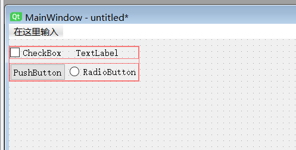

最后在空白区域再次使用垂直布局。这样即使我们缩放窗口，整个窗口内的控件也会跟着窗口的变化做出相应改变了。
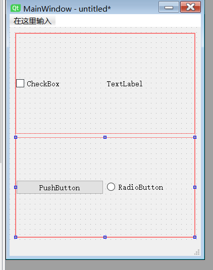

在上述操作的过程中，我们的一系列操作有决定这些物体的父子关系（层级关系）。而其层级关系在对象查看器中可以直观地看出。
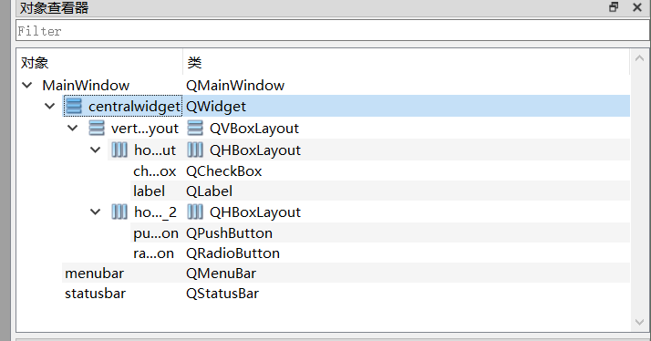

### 使用容器进行布局
容器（Container）指的就是能容纳其他子控件的一个控件。使用容器控件可以将容器控件中的所有控件归为一类，从而区别于其他的控件。
当然，正如上文提到过的，使用容器也可以对控件进行布局。
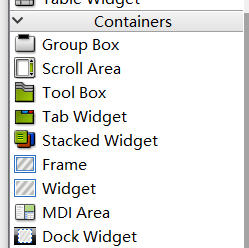

首先，从左侧的Container中拖出一个Frame控件到主窗口中，再拖出一个label、line input和button到Frame中。
此时Frame中的控件应该是如下图：
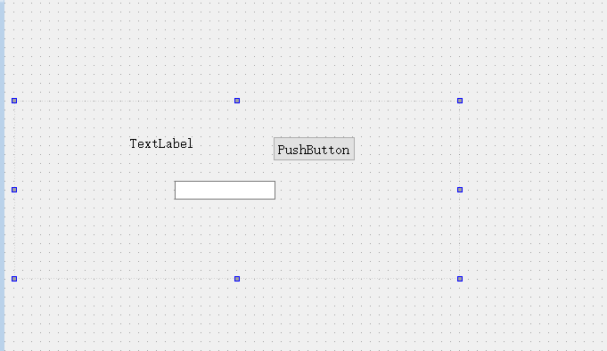

但选中Frame控件，点击右键-> Lay Out -> Lay Out Horizontally 则会自动水平排列Frame中的三个控件。
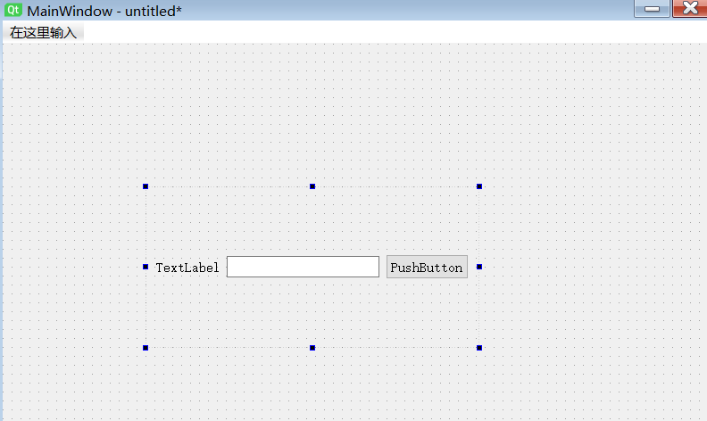

当我们需要变更Frame的位置的时候，可以直接拖动Frame到相应地位置，这样管理更加方便。使用容器进行布局的实质也是使用容器管理器进行布局的。

### 绝对布局
我们前面的学习重点放在了布局管理器上面。但是最简单的布局则是之间输入控件的Geometry属性值。
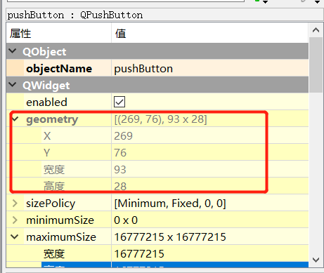

> [!NOTE]
> 如果之前对这个控件已经设置过了布局管理器，那么这里的绝对布局就不能再设置了。变成了灰色

在属性编辑器中，我们通过修改X Y值来将控件放置在相应地位置，通过修改Width和Height来更改其高度。
让我们通过如下表格来解读一下这个Button的Geometry属性。

| 名称     | 值   | 含义                   |
|--------|-----|----------------------|
| X      | 290 | 控件的最左上角距离主窗口的左侧290px |
| Y      | 140 | 控件的最左上角距离主窗口的上方140px |
| Width  | 93  | 按钮的宽度为93px           |
| Height | 28  | 按钮的高度为28px           |

## sizePolicy 尺寸策略
在Qt Designer中，控件的尺寸是可以变化的。每个控件都拥有sizeHint和minisizeHint两个尺寸。其一，sizeHint即尺寸提示；
其二，minisizeHint则是最小尺寸。尺寸提示也是控件的期望尺寸，最小尺寸即窗口可以被压缩到的最小的尺寸。
sizePolicy与sizeHint和minisizeHint息息相关。

对于布局管理器中的布局无法满足我们的要求的时候，sizePolicy属性便派上了用场。
sizePolicy可以实现控件的微调。sizePolicy中共有如下几种水平和垂直策略。

| 策略               | 中文   | 含义                                                            |
|------------------|------|---------------------------------------------------------------|
| Fixed            | 固定   | 窗口控件具有sizeHint提示的尺寸且尺寸不变                                      |
| Minimum          | 最小   | 窗口控件的sizeHint提示的尺寸即最小尺寸，窗口控件不能比这个值小，但是可以变大                    |
| Maximum          | 最大   | 窗口控件的sizeHint提示的尺寸即最大尺寸，窗口控件不能比这个值大，但是可以压缩到minisizeHint的尺寸    |
| Preferred        | 期望   | 窗口控件的sizeHint提示的尺寸是期望的尺寸，可以压缩到minisizeHint尺寸，也可以比sizeHint尺寸更大 |
| MinimumExpanding | 最小扩展 | 窗口控件的sizeHint提示的尺寸是最小尺寸，不能缩得比这个尺寸小，但是这个控件期望可以比这个尺寸大           |
| Expanding        | 扩展   | 窗口控件可以缩小到minisizeHint的尺寸，也可以比sizeHint的的尺寸大，但期望是更大             |
| Ignored          | 忽略   | 无视窗口控件的sizeHint与minisizeHint，按照默认来设置                          |

在sizePolicy的Horizontal Policy和Vertical Policy下面还有Horizontal Stretch和Vertical Stretch两个属性。
