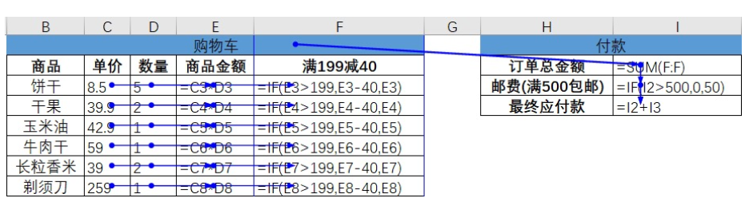

# Reactor03-走进响应式编程

## 三大核心特点

在开始讨论响应式编程（Reactive Programming）之前，先来看一个我们经常使用的一款堪称“响应式典范”的强大的生产力工具——电子表格。

相信大家都用过Excel中的公式，这是一个统计购物车商品和订单应付金额的表格，其中涉及到一些公式。



上图中蓝色的线是公式的引用关系，从中可以看出，“商品金额”是通过“单价x数量”得到的，“满199减40”会判断该商品金额是否满199并根据情况减掉40，
右侧“订单总金额”是“满199减40”这一列的和，“邮费”会根据订单总金额计算，“最终应付款”就是订单总金额加上邮费。

“单价”和“数量”的任何变动，都会被引用（“监听”）它的单元格实时更新计算结果，如果还有图表或数据透视图引用了这块数据，
那么也会相应变化，做到了实时响应。

这是响应式的核心特点之一：变化传递（propagation of change）。

我们再观察一下购物车，小明每次往购物车里添加或移除一种商品，或调整商品的购买数量，这种事件都会像过电一样流过这由公式串起来的多米诺骨牌一次。
这一次一次的操作事件连起来就是一串数据流（data stream），如果我们能够及时对数据流的每一个事件做出响应，会有效提高系统的响应水平。

这是响应式的另一个核心特点：基于数据流（data stream）。

公式可被组装成如下的伪代码：

``` java
public void listenOn(DataStream<CartEvent> cartEventStream) {
    double sum = 0；
    double total = cartEventStream
        // 分别计算商品金额
        .map(cartEvent -> cartEvent.getProduct().getPrice() * cartEvent.getQuantity())
        // 计算满减后的商品金额
        .map(v -> (v > 199) ? (v - 40) : v)
        // 将金额的变化累加到sum
        .map(v -> {sum += v; return sum;})
        // 根据sum判断是否免邮，得到最终总付款金额
        .map(sum -> (sum > 500) ? sum : (sum + 50));
}
```

命令式是面向过程的，声明式是面向结构的。

这是响应式的第三个核心特点：声明式（declarative）。

## 响应式流

为啥不用Java Stream来进行数据流的操作？原因在于，若将其用于响应式编程中，是有局限性的。比如如下两个需要面对的问题：

1. Web 应用具有I/O密集的特点，I/O阻塞会带来比较大的性能损失或资源浪费，我们需要一种异步非阻塞的响应式的库，而Java Stream是一种同步API。
2. 假设我们要搭建从数据层到前端的一个变化传递管道，可能会遇到数据层每秒上千次的数据更新，而显然不需要向前端传递每一次更新，
   这时候就需要一种流量控制能力，就像我们家里的水龙头，可以控制开关流速，而Java Stream不具备完善的对数据流的流量控制的能力。

具备“异步非阻塞”特性和“流量控制”能力的数据流，我们称之为响应式流（Reactive Stream）。
目前有几个实现了响应式流规范的Java库，这里简单介绍两个：RxJava和Reactor。

    要介绍RxJava，就不得不提ReactiveX（Reactive Extensions,Rx），它最初是LINQ的一个扩展，由微软的架构师Erik Meijer领导的团队开发，
    在2012年11月开源，Rx是一个编程模型，目标是提供一致的编程接口，帮助开发者更方便的处理异步数据流，Rx库支持.NET、JavaScript和C++，
    Rx近几年越来越流行了，现在已经支持几乎全部的流行编程语言了，包括RxJS、RxJava等。
    
    后来，Java社区的一些大牛凑到一起制定了一个响应式流规范。RxJava团队随后对1版本进行了重构，形成了兼容该响应流规范的RxJava 2。
    
    Reactor是Pivotal旗下的项目，与大名鼎鼎的Spring是兄弟关系，因此是Spring近期推出的响应式模块WebFlux的“御用”响应式流。
    Reactor支持响应式流规范，与RxJava相比，它没有任何历史包袱，专注于Server端的响应式开发，而RxJava更多倾向于Android端的响应式开发。
    
    在Java 9版本中，响应式流的规范被纳入到了JDK中，相应的API接口是java.util.concurrent.Flow。
    
    Spring WebFlux也是本系列文章后边的重点内容。由于WebFlux首选Reactor作为其响应式技术栈的一部分，我们下边也主要以Reactor为主，
    目前的版本是Reactor3。

从调用者和服务提供者的角度来看，阻塞、非阻塞以及同步、异步可以这么理解：

* 阻塞和非阻塞反映的是调用者的状态，当调用者调用了服务提供者的方法后，如果一直在等待结果返回，否则无法执行后续的操作，那就是阻塞状态；
  如果调用之后直接返回，从而可以继续执行后续的操作，那可以理解为非阻塞的。
* 同步和异步反映的是服务提供者的能力，当调用者调用了服务提供者的方法后，如果服务提供者能够立马返回，并在处理完成后通过某种方式通知到调用者，
  那可以理解为异步的；否则，如果只是在处理完成后才返回，或者需要调用者再去主动查询处理是否完成，就可以理解为是同步的。

## 响应式编程总结

总结起来，响应式编程（reactive programming）是一种基于响应式流（reactor stream）
和变化传递（propagation of change）的声明式（declarative）的编程范式。

其中响应式流（reactor stream）= 异步非阻塞 + 背压机制。

## Reactor 3介绍

Reactor 3框架是Pivotal（Spring 母公司）基于Reactive Programming思想实现的。Spring Cloud 使用的响应式web框架 Webflux由Reactor实现。

reactor3 优势特点：

1. 可以将处理的数据视为stream，这也使得reactor的用法和java8的stream很像，流式处理数据更加函数式减少副作用，更加方便用于多线程处理
2. 可读性强，流式的编写，每一环节逻辑更清晰，避免了回调地狱
3. 组合性强，可使用先前任务的结果将输入反馈给后续任务
4. 事件的生产者和消费者拆成 Publisher和Publisher， Publisher只管准备数据，在Publisher订阅之前不会发生消费情况
5. 背压，Reactor比较重要的特征，事件下游可以通过反馈调节上游的生产速度
6. cold & hot：只有在观察者订阅的时候才会使用的数据源为cold，就是说数据源是Lazy的；hot一直在变，例如数据流，你不观察数据流也不会停止等你来观察

**这种编程范式如何让Web应用更加“reactive”呢？**

我们设想这样一种场景，我们从底层数据库驱动，经过持久层、服务层、MVC层中的model，到用户的前端界面的元素，全部都采用声明式的编程范式，
从而搭建一条能够传递变化的管道，这样我们只要更新一下数据库中的数据，用户的界面上就相应的发生变化，岂不美哉？尤其重要的是，一处发生变化，
我们不需要各种命令式的调用来传递这种变化，而是由搭建好的“流水线”自动传递。

这种场景用在哪呢？比如一个日志监控系统，我们的前端页面将不再需要通过“命令式”的轮询的方式不断向服务器请求数据然后进行更新，
而是在建立好通道之后，数据流从系统源源不断流向页面，从而展现实时的指标变化曲线；再比如一个社交平台，朋友的动态、点赞和留言不是手动刷出来的，
而是当后台数据变化的时候自动体现到界面上的。

## 学习准备

官网：https://projectreactor.io/docs/core/release/reference/

中文参考文档：https://htmlpreview.github.io/?https://github.com/get-set/reactor-core/blob/master-zh/src/docs/index.html

创建maven项目，引入如下依赖

``` xml
<dependency>
    <groupId>io.projectreactor</groupId>
    <artifactId>reactor-tools</artifactId>
    <version>3.4.12</version>
</dependency>
<dependency>
    <groupId>io.projectreactor.addons</groupId>
    <artifactId>reactor-extra</artifactId>
    <version>3.4.12</version>
</dependency>
<dependency>
    <groupId>io.projectreactor</groupId>
    <artifactId>reactor-test</artifactId>
    <scope>test</scope>
    <version>3.4.12</version>
</dependency>
<dependency>
  <groupId>org.junit.jupiter</groupId>
  <artifactId>junit-jupiter</artifactId>
  <version>5.7.2</version>
</dependency>
<dependency>
    <groupId>org.projectlombok</groupId>
    <artifactId>lombok</artifactId>
    <version>1.18.22</version>
</dependency>
```
