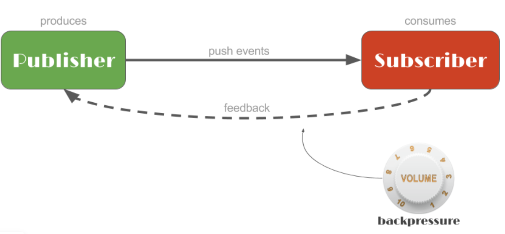

# Reactor04-创建Mono和Flux

在响应式流规范中有两种主要角色，一个是数据流的生产者Publisher（上游），一个是消费者Subscriber（下游）。
生产者通过publish来生产数据，消费者通过subscribe方法来订阅生产者的数据。并且下游消费者还能通过背压方式给上游生产者提供反馈，
从而限制生产者产生数据的频率。



Reactor中有两种Publisher：Flux和Mono，其中Flux用来表示0-N个元素的异步序列，Mono用来表示0-1个元素的异步序列，相对于Flux而言Mono更简单一些。

## 创建Mono
reactor中的mono可以通过一些方法创建，常用方法如下：

* `just(T.. data)`：可以指定序列中包含的全部元素。
* `empty()`：创建一个不包含任何元素。
* `error(Throwable error)`：创建一个只包含错误消息的序列。
* `fromCallable()`、`fromCompletionStage()`、`fromFuture()`、`fromRunnable()`和 `fromSupplier()`：
分别从 Callable、CompletionStage、CompletableFuture、Runnable 和 Supplier 中创建 Mono。
* `delay(Duration duration)`：创建一个 Mono 序列，在指定的延迟时间之后，产生数字 0 作为唯一值。
* `ignoreElements(Publisher source)`：创建一个 Mono 序列，忽略作为源的 Publisher 中的所有元素，只产生结束消息。
* `justOrEmpty(Optional<? extends T> data)`和 `justOrEmpty(T data)`：从一个 Optional 对象或可能为 null 的对象中创建 Mono。
只有 Optional 对象中包含值或对象不为 null 时，Mono 序列才产生对应的元素。

```java
import lombok.extern.slf4j.Slf4j;
import reactor.core.publisher.Flux;
import reactor.core.publisher.Mono;
import reactor.test.StepVerifier;

import org.junit.jupiter.api.Test;

import java.time.Duration;
import java.util.Date;
import java.util.concurrent.CompletableFuture;

/**
 * MonoTest
 *
 * @author XiongNeng
 * @since 1.0.0
 */
@Slf4j
public class MonoTest {
    @Test
    public void mono() {
        // 通过just直接赋值
        Mono.just("my name is ffzs").subscribe(log::info);
        // empty 创建空mono
        Mono.empty().subscribe();
        // 延迟生成0
        Mono.delay(Duration.ofMillis(2)).map(String::valueOf).subscribe(log::info);
        // 通过Callable
        Mono.fromCallable(() -> "callback function").subscribe(log::info);
        // future
        Mono.fromFuture(CompletableFuture.completedFuture("from future")).subscribe(log::info);
        // 通过runnable
        Mono<Void> runnableMono = Mono.fromRunnable(() -> log.warn(Thread.currentThread().getName()));
        runnableMono.subscribe();
        // 通过使用 Supplier
        Mono.fromSupplier(() -> new Date().toString()).subscribe(log::info);
        // flux中
        Mono.from(Flux.just("from", "flux")).subscribe(log::info);  // 只返回flux第一个

        // 使用StepVerifier做测试
        Mono<String> mono = Mono.just("ffzs");
        StepVerifier.create(mono).expectNext("ffzs").verifyComplete();
    }
}
```

## 创建Flux

因为是表示连续序列Flux和Mono的创建方法，有些不同，下面是flux的一些创建方法：

* `just(T.. data)`：可以指定序列中包含的全部元素。
* `range()`: 可以用来创建连续数值
* `empty()`：创建一个不包含任何元素。
* `error(Throwable error)`：创建一个只包含错误消息的序列。
* `fromIterable()`: 通过迭代器创建如list，set
* `fromStream()`: 通过流创建
* `fromArray(T[])`: 通过列表创建 如 String[], Integer[]
* `merge()`: 通过将两个flux合并得到新的flux
* `interval()`: 每隔一段时间生成一个数字，从1开始递增

下面是使用示例
```java
@Slf4j
public class FluxTest {
    @Test
    public void flux() throws InterruptedException {
        Flux<Integer> intFlux = Flux.just(1, 2, 3, 4, 5);
        Flux<Integer> rangeFlux = Flux.range(6, 4);  // 以6开始，取4个值：6,7,8,9
        Flux.fromArray(new Integer[]{1, 3, 4, 5, 6, 12}).subscribe(System.out::println);  // 通过fromArray构建
        Flux<String> strFluxFromStream = Flux.fromStream(Stream.of("just", "test", "reactor", "Flux", "and", "Mono"));
        Flux<String> strFluxFromList = Flux.fromIterable(
                Arrays.asList("just", "test", "reactor", "Flux", "and", "Mono"));
        // 通过merge合并
        Flux<String> strMerge = Flux.merge(strFluxFromStream, strFluxFromList);
        Flux<Integer> intFluxMerged = Flux.merge(intFlux, rangeFlux);
        strMerge.subscribe(log::info);
        intFluxMerged.subscribe(i -> log.info("{}", i));
        // 通过interval创建流数据
        Flux.interval(Duration.ofMillis(100)).map(String::valueOf).subscribe(log::info);
        Thread.sleep(2000);
    }
}
```

## 关于Mono.defer()

在WebFlux编程过程中经常会碰到这3个常用的创建Mono对象的方法：`Mono.just()`、`Mono.defer()`、`Mono.create()`

这里来解释一下这3者的区别和使用场景。

1. Mono.just(value) is the most primitive - once you have a value you can wrap it into a Mono 
and subscribers down the line will get it.
2. Mono.defer(monoSupplier) lets you provide the whole expression that supplies the resulting Mono instance. 
The evaluation of this expression is deferred until somebody subscribes. 
Inside of this expression you can additionally use control structures like Mono.error(throwable) 
to signal an error condition (you cannot do this with Mono.just).
3. Mono.create(monoSinkConsumer) is the most advanced method that gives you the full control over the emitted values. 
Instead of the need to return Mono instance from the callback (as in Mono.defer), 
you get control over the MonoSink<T> that lets you emit values through MonoSink.success(), 
MonoSink.success(value), MonoSink.error(throwable) methods. 
Reactor documentation contains a few good examples of possible Mono.create use cases: 
[link to doc](https://projectreactor.io/docs/core/release/api/reactor/core/publisher/Mono.html#create-java.util.function.Consumer-).

这样就很容易能解释清楚，`mono.map(result -> methodA()).switchIfEmpty(Mono.just())`，为啥Mono.just()的执行会优先于map的执行了。

最佳使用顺序的建议是: Mono.just -> Mono.defer -> Mono.create。另外在switchIfEmpty的场景推荐使用`Mono.defer`。

参考链接：https://stackoverflow.com/questions/56115447/mono-defer-vs-mono-create-vs-mono-just

