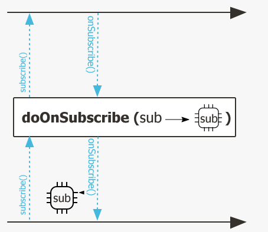
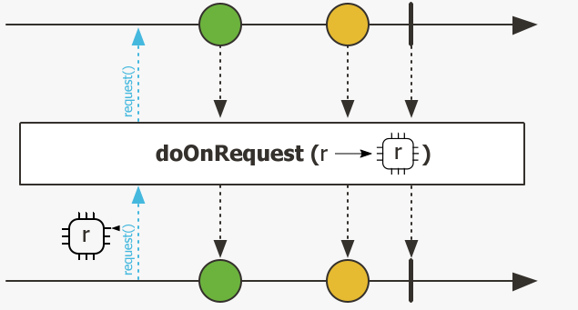
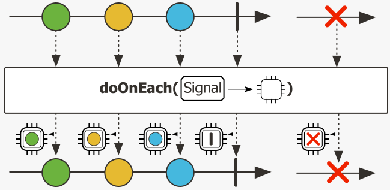
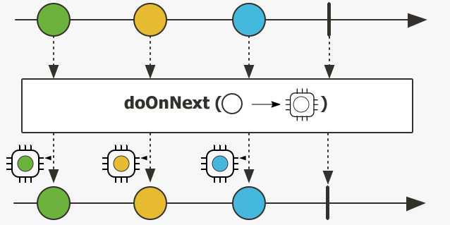
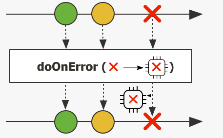
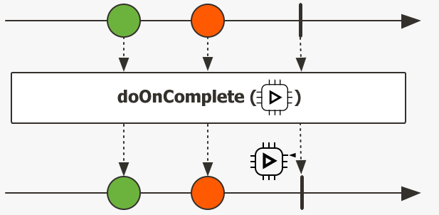
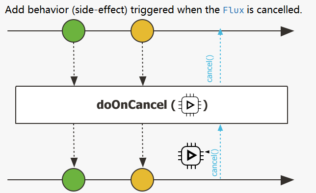

# Reactor05-监控与doOn系列方法

在Publisher使用`subscribe()`方法的时候，Subscriber通过一系列的on方法触发事件响应，如`onSubscribe()`；为了更好的监控以及观测异步序列的传递情况，
Publisher对象设置了一系列的doOn方法，用于在Subscriber触发on方法的时候进行监控。

注doOnXXX方法是“偷窥式”或者“监控式”的方法，没有副作用，不会消费数据流。

常见的doOn方法如下，以Flux举例：

## doOnSubscribe()

用以监控`Subscriber#onSubscribe`方法的执行，也就是下游订阅上游事件的时候触发。



``` java
/**
 * Add behavior (side-effect) triggered when the {@link Flux} is being subscribed,
 * that is to say when a {@link Subscription} has been produced by the {@link Publisher}
 * and is being passed to the {@link Subscriber#onSubscribe(Subscription)}.
 * <p>
 
 * @param onSubscribe the callback to call on {@link Subscriber#onSubscribe}
 *
 * @return an observed  {@link Flux}
 */
public final Flux<T> doOnSubscribe(Consumer<? super Subscription> onSubscribe) {
    Objects.requireNonNull(onSubscribe, "onSubscribe");
    return doOnSignal(this, onSubscribe, null, null, null, null, null, null);
}
```

## doOnRequest()

监控`request()`方法的执行。



``` java
/**
 * Add behavior (side-effect) triggering a {@link LongConsumer} when this {@link Flux}
 * receives any request.
 * <p>
 *     Note that non fatal error raised in the callback will not be propagated and
 *     will simply trigger {@link Operators#onOperatorError(Throwable, Context)}.
 *
 * The {@link LongConsumer} is executed first, then the request signal is propagated
 * upstream to the parent.
 *
 * @param consumer the consumer to invoke on each request
 *
 * @return an observed  {@link Flux}
 */
public final Flux<T> doOnRequest(LongConsumer consumer) {
    Objects.requireNonNull(consumer, "consumer");
    return doOnSignal(this, null, null, null, null, null, consumer, null);
}
```

## doOnEach()

监控Publisher发布的每一个数据元素。这个跟下面要讲的`doOnNext()`方法作用基本上一样。唯一区别是这个方法支持错误和完成事件的传播。



``` java
/**
 * Add behavior (side-effects) triggered when the {@link Flux} emits an item, fails with an error
 * or completes successfully. All these events are represented as a {@link Signal}
 * that is passed to the side-effect callback. Note that this is an advanced operator,
 * typically used for monitoring of a Flux. These {@link Signal} have a {@link Context}
 * associated to them.
 * <p>
 * The {@link Consumer} is executed first, then the relevant signal is propagated
 * downstream.
 *
 * @param signalConsumer the mandatory callback to call on
 *   {@link Subscriber#onNext(Object)}, {@link Subscriber#onError(Throwable)} and
 *   {@link Subscriber#onComplete()}
 * @return an observed {@link Flux}
 */
public final Flux<T> doOnEach(Consumer<? super Signal<T>> signalConsumer) {
    if (this instanceof Fuseable) {
        return onAssembly(new FluxDoOnEachFuseable<>(this, signalConsumer));
    }
    return onAssembly(new FluxDoOnEach<>(this, signalConsumer));
}
```

## doOnNext()

监控Publisher发布的每一个数据元素，这个方法不支持事件的传播。



``` java
/**
 * Add behavior (side-effect) triggered when the {@link Flux} emits an item.
 * <p>
 * The {@link Consumer} is executed first, then the onNext signal is propagated
 * downstream.
 *
 * Error Mode Support:</strong> This operator supports {@link #onErrorContinue(BiConsumer) resuming on errors}
 * (including when fusion is enabled). Exceptions thrown by the consumer are passed to
 * the {@link #onErrorContinue(BiConsumer)} error consumer (the value consumer
 * is not invoked, as the source element will be part of the sequence). The onNext
 * signal is then propagated as normal.
 *
 * @param onNext the callback to call on {@link Subscriber#onNext}
 *
 * @return an observed  {@link Flux}
 */
public final Flux<T> doOnNext(Consumer<? super T> onNext) {
    Objects.requireNonNull(onNext, "onNext");
    return doOnSignal(this, null, onNext, null, null, null, null, null);
}
```

## doOnError()

用于监控错误事件，可以通过错误类型进行筛选。注意主要出现错误整个流就结束了。



``` java
/**
 * Add behavior (side-effect) triggered when the {@link Flux} completes with an error.
 * <p>
 * The {@link Consumer} is executed first, then the onError signal is propagated
 * downstream.
 *
 * @param onError the callback to call on {@link Subscriber#onError}
 *
 * @return an observed  {@link Flux}
 */
public final Flux<T> doOnError(Consumer<? super Throwable> onError) {
    Objects.requireNonNull(onError, "onError");
    return doOnSignal(this, null, null, onError, null, null, null, null);
}
```

## doOnComplete()

整个流正常结束后会触发。



``` java
/**
 * Add behavior (side-effect) triggered when the {@link Flux} completes successfully.
 * <p>
 * The {@link Runnable} is executed first, then the onComplete signal is propagated
 * downstream.
 *
 * @param onComplete the callback to call on {@link Subscriber#onComplete}
 *
 * @return an observed  {@link Flux}
 */
 public final Flux<T> doOnComplete(Runnable onComplete) {
    Objects.requireNonNull(onComplete, "onComplete");
    return doOnSignal(this, null, null, null, onComplete, null, null, null);
}
```

## doOnCancel()

取消流的时候会触发。



``` java
/**
 * Add behavior (side-effect) triggered when the {@link Flux} is cancelled.
 * <p>
 * The handler is executed first, then the cancel signal is propagated upstream
 * to the source.
 *
 * @param onCancel the callback to call on {@link Subscription#cancel}
 *
 * @return an observed  {@link Flux}
 */
public final Flux<T> doOnCancel(Runnable onCancel) {
    Objects.requireNonNull(onCancel, "onCancel");
    return doOnSignal(this, null, null, null, null, null, null, onCancel);
}
```

## doOnTerminate()

终止时触发，无论是成功还是出现异常。也就是上面`doOnError()`和`doOnComplete()`两种常见都会触发。

## 代码示例

```java
@Slf4j
public class DoOnTest {
    @Test
    public void testDoOn() {
        Flux.range(1, 3)
                .doOnSubscribe(e -> log.info("doOnSubscribe:{}", e))
                .doOnEach(e -> log.info("doOnEach:{}", e))
                .doOnError(e -> log.error("doOnError:", e))
                .doOnNext(e -> log.info("doOnNext:{}", e))
                .doOnRequest(e -> log.info("doOnRequest:{}", e))
                .doOnTerminate(new Runnable() {
                    @Override
                    public void run() {
                        log.info("doOnTerminate");
                    }
                })
                .doOnCancel(new Runnable() {
                    @Override
                    public void run() {
                        log.info("doOnCancel");
                    }
                })
                .doOnComplete(new Runnable() {
                    @Override
                    public void run() {
                        log.info("doOnComplete");
                    }
                })
                .subscribe(new DemoSubsriber());
    }

    @Slf4j
    private static class DemoSubsriber implements Subscriber<Integer> {
        @Override
        public void onSubscribe(Subscription s) {
            log.info("request max");
            s.request(Integer.MAX_VALUE);
        }

        @Override
        public void onNext(Integer integer) {
            log.info("get data:{}", integer);
        }

        @Override
        public void onError(Throwable t) {
            log.info("onError");
        }

        @Override
        public void onComplete() {
            log.info("onComplete");
        }
    }
}
```

打印结果如下
```
DEBUG reactor.util.Loggers - Using Slf4j logging framework
INFO com.xncoding.reactor.doon.DoOnTest - doOnSubscribe:reactor.core.publisher.FluxRange$RangeSubscription@8c3b9d
INFO com.xncoding.reactor.doon.DoOnTest$DemoSubsriber - request max
INFO com.xncoding.reactor.doon.DoOnTest - doOnRequest:2147483647
INFO com.xncoding.reactor.doon.DoOnTest - doOnEach:doOnEach_onNext(1)
INFO com.xncoding.reactor.doon.DoOnTest - doOnNext:1
INFO com.xncoding.reactor.doon.DoOnTest$DemoSubsriber - get data:1
INFO com.xncoding.reactor.doon.DoOnTest - doOnEach:doOnEach_onNext(2)
INFO com.xncoding.reactor.doon.DoOnTest - doOnNext:2
INFO com.xncoding.reactor.doon.DoOnTest$DemoSubsriber - get data:2
INFO com.xncoding.reactor.doon.DoOnTest - doOnEach:doOnEach_onNext(3)
INFO com.xncoding.reactor.doon.DoOnTest - doOnNext:3
INFO com.xncoding.reactor.doon.DoOnTest$DemoSubsriber - get data:3
INFO com.xncoding.reactor.doon.DoOnTest - doOnEach:onComplete()
INFO com.xncoding.reactor.doon.DoOnTest - doOnTerminate
INFO com.xncoding.reactor.doon.DoOnTest - doOnComplete
INFO com.xncoding.reactor.doon.DoOnTest$DemoSubsriber - onComplete
```

总结一句话：doOn系列方法是publisher的同步钩子方法，在subscriber触发一系列事件的时候触发。
