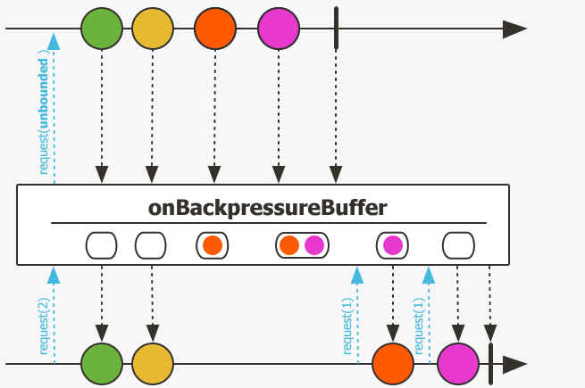
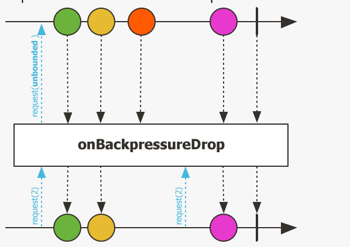
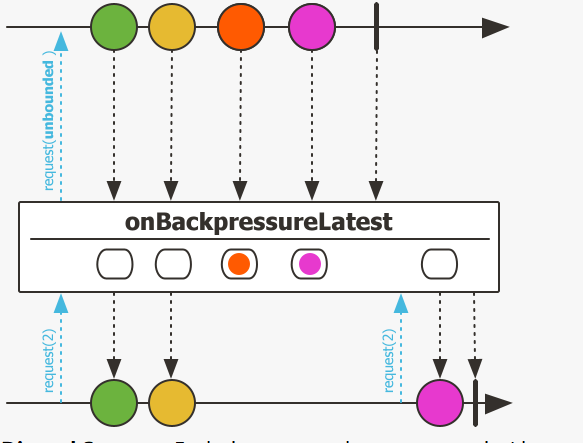
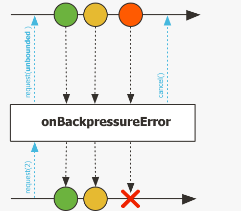
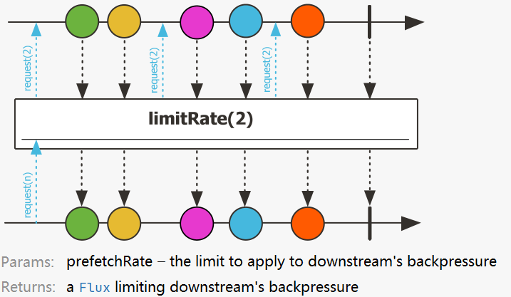

# Reactor07-使用背压机制

有这样的情况，上游传递到下游的数据需要进行处理，然而上游推送的速度又很快，下游由于资源等原因来不及处理；如果这时还是通过不限制上游速度的方式推送数据，
就会出问题，因此Reactive Streams有一种处理方式，就是通过request的机制向上游传递信号，并指定接收数量；
通过这种方法将push模型转化为push-pull hybrid，这就是backpressure的用法。

这一节讨论回压的问题，有两个前提：

1. 发布者与订阅者不在同一个线程中，因为在同一个线程中的话，通常使用传统的逻辑就可以，不需要进行回压处理；
2. 发布者发出数据的速度高于订阅者处理数据的速度，也就是处于PUSH状态下。

## 回压策略
回压的处理有以下几种策略：

* ERROR： 当下游跟不上节奏的时候发出一个错误信号。
* DROP：当下游没有准备好接收新的元素的时候抛弃这个元素。
* LATEST：让下游只得到上游最新的元素。
* BUFFER：缓存下游没有来得及处理的元素（如果缓存不限大小的可能导致OutOfMemoryError）。

这几种策略定义在枚举类型OverflowStrategy中，不过还有一个IGNORE类型，即完全忽略下游背压请求，
这可能会在下游队列积满的时候导致 IllegalStateException。

## 使用create声明回压策略
用于生成数据流的方法create和push可以用于异步的场景，而且它们也支持回压，我们可以通过提供一个 OverflowStrategy 来定义背压行为。
方法签名：
``` java
public static <T> Flux<T> create(Consumer<? super FluxSink<T>> emitter, OverflowStrategy backpressure) 
```

默认（没有第二个参数的方法）是缓存策略的，接下来我们验证这些策略。

首先是定义一个“快的发布者”和一个“慢的订阅者”，如下

``` java
public class BackPressure2 {
    private final int EVENT_DURATION = 10;    // 生成的事件间隔时间，单位毫秒
    private final int EVENT_COUNT = 20;    // 生成的事件个数
    private final int PROCESS_DURATION = 30;    // 订阅者处理每个元素的时间，单位毫秒

    private Flux<MyEventSource.MyEvent> fastPublisher;
    private SlowSubscriber slowSubscriber;
    private MyEventSource eventSource;
    private CountDownLatch countDownLatch;

    public BackPressure2() {
        countDownLatch = new CountDownLatch(1);
        slowSubscriber = new SlowSubscriber();
        eventSource = new MyEventSource();
    }

    public void testCreateBackPressureStratety() throws InterruptedException {
        fastPublisher = createFlux(FluxSink.OverflowStrategy.BUFFER)    // 1
                .doOnRequest(n -> System.out.println("===request:" + n + "==="))    // 2
                .publishOn(Schedulers.newSingle("newSingle"), 1);   // 3
        subscribe(); // 开始订阅
    }

    public void subscribe() throws InterruptedException {
        fastPublisher.subscribe(slowSubscriber);
        generateEvent(EVENT_COUNT, EVENT_DURATION);
        countDownLatch.await(1, TimeUnit.MINUTES);
    }

    /**
     * 使用create方法生成“快的发布者”。
     *
     * @param strategy 回压策略
     * @return Flux
     */
    private Flux<MyEventSource.MyEvent> createFlux(FluxSink.OverflowStrategy strategy) {

        return Flux.create(sink -> eventSource.register(new MyEventListener() {
            @Override
            public void onNewEvent(MyEventSource.MyEvent event) {
                System.out.println("publish >>> " + event.getMessage());
                sink.next(event);
            }

            @Override
            public void onEventStopped() {
                sink.complete();
            }
        }), strategy);
    }

    /**
     * 生成MyEvent。
     *
     * @param times 生成MyEvent的个数。
     * @param millis 每个MyEvent之间的时间间隔。
     */
    private void generateEvent(int times, int millis) {
        // 循环生成MyEvent，每个MyEvent间隔millis毫秒
        for (int i = 0; i < times; i++) {
            try {
                TimeUnit.MILLISECONDS.sleep(millis);
            } catch (InterruptedException e) {
            }
            eventSource.newEvent(new MyEventSource.MyEvent(new Date(), "Event-" + i));
        }
        eventSource.eventStopped();
    }

    /**
     * 内部类，“慢的订阅者”。
     */
    class SlowSubscriber extends BaseSubscriber<MyEventSource.MyEvent> {

        @Override
        protected void hookOnSubscribe(Subscription subscription) {
            request(1);  // 订阅时请求1个数据
        }

        @Override
        protected void hookOnNext(MyEventSource.MyEvent event) {
            System.out.println("receive <<< " + event.getMessage());
            try {
                TimeUnit.MILLISECONDS.sleep(PROCESS_DURATION);
            } catch (InterruptedException e) {
            }
            request(1);  // 每处理完1个数据，就再请求1个
        }

        @Override
        protected void hookOnError(Throwable throwable) {
            System.err.println("receive <<< " + throwable);
        }

        @Override
        protected void hookOnComplete() {
            countDownLatch.countDown();
        }
    }
}
```

1. 调整不同的策略（BUFFER/DROP/LATEST/ERROR/IGNORE）观察效果，create方法默认为BUFFER；
2. 打印出每次request的请求；
3. 使用publishOn让后续的操作符和订阅者运行在一个单独的名为newSingle的线程上，第二个参数1是预取个数。
也就是publishOn作为订阅者每次向上游request的个数，默认为256，所以一定程度上也起到了缓存的效果，为了测试，设置为1。

BUFFER策略的输出如下（来不及处理的数据会缓存下来，这是通常情况下的默认策略）：
```
===request:1===
publish >>> Event-0
        receive <<< Event-0
publish >>> Event-1
publish >>> Event-2
publish >>> Event-3
===request:1===
        receive <<< Event-1
publish >>> Event-4
publish >>> Event-5
===request:1===
        receive <<< Event-2
publish >>> Event-6
publish >>> Event-7
===request:1===
        receive <<< Event-3
publish >>> Event-8
publish >>> Event-9
```

DROP策略的输出如下（有新数据就绪的时候，看是否有request，有的话就发出，没有就丢弃）：
```
===request:1===
publish >>> Event-0
        receive <<< Event-0
publish >>> Event-1
publish >>> Event-2
===request:1===
publish >>> Event-3
        receive <<< Event-3
publish >>> Event-4
publish >>> Event-5
===request:1===
publish >>> Event-6
        receive <<< Event-6
```
可以看到，第1/2/4/5/…的数据被丢弃了，当有request之后的数据会被发出。

LATEST的输出如下（request到来的时候，将最新的数据发出）：
```
===request:1===
publish >>> Event-0
        receive <<< Event-0
publish >>> Event-1
publish >>> Event-2
publish >>> Event-3
===request:1===
        receive <<< Event-3
publish >>> Event-4
publish >>> Event-5
===request:1===
        receive <<< Event-5
publish >>> Event-6
publish >>> Event-7
```

ERROR的输出如下（当订阅者来不及处理时候发出一个错误信号）：
```
===request:1===
publish >>> Event-0
        receive <<< Event-0
publish >>> Event-1
publish >>> Event-2
===request:1===
        receive <<< reactor.core.Exceptions$OverflowException: The receiver is overrun by more signals than expected (bounded queue...)
```

IGNORE的输出如下：
```
===request:1===
publish >>> Event-4
        receive <<< Event-2
publish >>> Event-5
publish >>> Event-6
===request:1===
        receive <<< reactor.core.Exceptions$OverflowException: Queue is full: Reactive Streams source doesn't respect backpressure
```

## 回压策略图解

这里通过官方的图片来演示一下这几种回压策略。

Reactor提供了响应的onBackpressureXxx操作符，调整回压策略。方法如下：
``` java
/**
 * 测试不同的onBackpressureXxx方法的效果。
 */
@Test
public void testOnBackPressureXxx() {
    fastPublisher = createFlux(FluxSink.OverflowStrategy.BUFFER)
            .onBackpressureBuffer()     // BUFFER
//                .onBackpressureDrop()     // DROP
//                .onBackpressureLatest()   // LATEST
//                .onBackpressureError()    // ERROR
            .doOnRequest(n -> System.out.println("         ===  request: " + n + " ==="))
            .publishOn(Schedulers.newSingle("newSingle"), 1);
}
```
通过查看这些方法的注释，JavaDoc里面就有图片注解，很清楚的能解释这几种策略

onBackpressureBuffer，对于来自其下游的request采取“缓存”策略。


onBackpressureDrop，元素就绪时，根据下游是否有未满足的request来判断是否发出当前元素。


onBackpressureLatest，当有新的request到来的时候，将最新的元素发出。


onBackpressureError，当有多余元素就绪时，发出错误信号。


## 通过编写Subscriber实现backpressure

下面介绍backpressure比较原始的写法，通过构建Subscriber控制request的大小。

* 通过使用count对控制request的触发
* 指定每次request的大小，实际生产中可以根据资源情况动态调节

``` java
@Slf4j
public class BackPressure {
    public void rawBackPressure() {
        Flux<String> flux = Flux.range(1, 6)
                .map(i -> String.valueOf(i))
                .doOnRequest(i -> log.info("each request={}", i));

        flux.subscribe(new Subscriber<String>() {
            private int count = 0;
            private Subscription subscription;
            private int requestCount = 2;

            @Override
            public void onSubscribe(Subscription s) {
                this.subscription = s;
                s.request(requestCount);  // 启动
            }

            @SneakyThrows
            @Override
            public void onNext(String s) {
                log.info("each item = {}", s);
                count++;
                if (count == requestCount) {  // 通过count控制每次request两个元素
                    Thread.sleep(1000);
                    subscription.request(requestCount);
                    count = 0;
                }
            }
            @Override
            public void onError(Throwable t) {
            }

            @Override
            public void onComplete() {
            }
        });
    }
}
```

打印结果
```
[main] DEBUG reactor.util.Loggers - Using Slf4j logging framework
[main] INFO com.xncoding.reactor.basic.BackPressure - each request=2
[main] INFO com.xncoding.reactor.basic.BackPressure - each item = 1
[main] INFO com.xncoding.reactor.basic.BackPressure - each item = 2
[main] INFO com.xncoding.reactor.basic.BackPressure - each request=2
[main] INFO com.xncoding.reactor.basic.BackPressure - each item = 3
[main] INFO com.xncoding.reactor.basic.BackPressure - each item = 4
[main] INFO com.xncoding.reactor.basic.BackPressure - each request=2
[main] INFO com.xncoding.reactor.basic.BackPressure - each item = 5
[main] INFO com.xncoding.reactor.basic.BackPressure - each item = 6
[main] INFO com.xncoding.reactor.basic.BackPressure - each request=2
```

## 通过编写BaseSubscriber实现backpressure

可以使用功能更多的BaseSubscriber类处理背压逻辑，因为BaseSubscriber的一些方法可以简化处理的逻辑

``` java
public void baseBackPressure() {
    Flux<Integer> flux = Flux.range(1, 6).log();

    flux.subscribe(new BaseSubscriber<Integer>() {
        private int count = 0;
        private final int requestCount = 2;

        @Override
        protected void hookOnSubscribe(Subscription subscription) {
            request(requestCount);
        }

        @SneakyThrows
        @Override
        protected void hookOnNext(Integer value) {
            count++;
            if (count == requestCount) {  // 通过count控制每次request两个元素
                Thread.sleep(1000);
                request(requestCount);
                count = 0;
            }
        }
    });
}
```
运行结果一样，request(2)之后执行两个next。

## 通过使用limitRate()方法实现



``` java
public void backPressureLimitRate(){
    Flux.range(1,6)
            .log()
            .limitRate(2)
            .subscribe(item -> {
                try {
                    Thread.sleep(1000);
                } catch (InterruptedException e) {
                    e.printStackTrace();
                }
            });
}
```

## 总结

当进行异步编程时，通常会面临相互协作的各个组件不在同一个线程的情况，比如一个生产者不断生成消息，而一个消费者不断处理这些产生的消息，
二者通常不在一个线程甚至是两个不同的组件。当有人不小心采用了无界资源（比如无上限的弹性线程池、无界队列等），
那么在高并发或任务繁重时就有可能造成线程数爆炸增长，或队列堆积，因此backpressure这种协调机制对于维持系统稳定具有重要作用。

