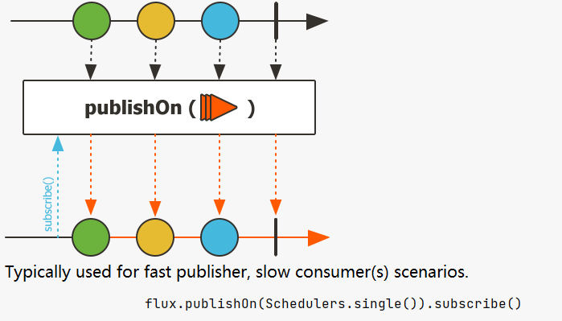
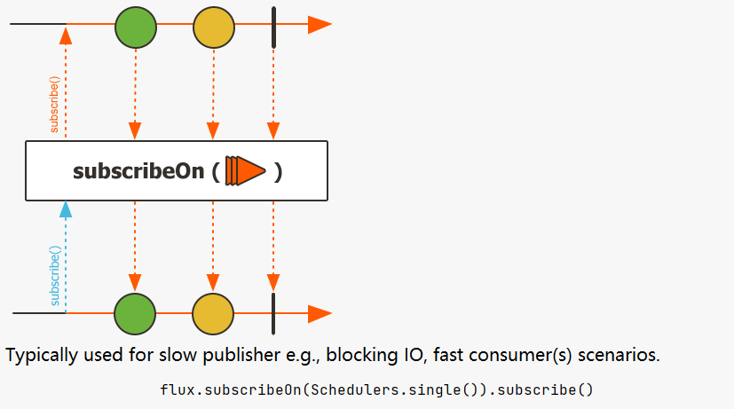

# Reactor09-并发和调度器

Stream中的并行处理非常简单，只要加上parallel()，就可以将stream并行化：

``` java
public void streamParallel () {
    Stream.of(1,2,3,4,5,6,7,8).parallel().map(String::valueOf).forEach(log::info);
}
```

根据结果中线程使用情况可知这种操作就完成了stream的并行化。这个是JDK内部实现的调度。

Reactor的并行化跟stream一样简单，不同于stream对并行的不可控，Reator还提供了可以对并行运行的调度器Schedulers。

## Schedulers简介

在Reactor中，并行执行以及执行的位置由所Scheduler确定 。

Schedulers 类有如下几种对上下文操作的静态方法：

* `immediate()`：无执行上下文，提交的Runnable将直接在原线程上执行，可以理解没有调度
* `single()`：内置的可重用单线程，使用一个线程处理所有请求
* `newSingle()`：创建新的可重用单线程，使用一个线程处理所有请求
* `elastic()`： 内置的没有边界的弹性线程池
* `newElastic()`： 创建新的没有边界的弹性线程池
* `boundedElastic()`：内置的有边界弹性线程池，设置线程限制，默认为cpu核心数*10。达到上限后最多可以提交10万个任务。是阻塞线程的方法
* `parallel()`：内置的固定线程数量的并行线程池，线程数量和cpu内核一样多
* `newParallel()`：创建新的固定线程数量的并行线程池，线程数量和cpu内核一样多

Reactor 提供了两种通过Scheduler切换上下文执行的方法：publishOn和subscribeOn。

* publishOn在执行顺序中的位置很重要
* subscribeOn的位置不重要

## publishOn方法



publishOn可以用来切换执行链中上下文执行模式，通常用于Publisher快，Consumer慢的场景。

``` java
public void publishOn() throws InterruptedException {
    Scheduler s = Schedulers.newParallel("parallel-scheduler", 4);

    final Flux<String> flux = Flux
            .range(1, 2)
            .map(i -> {
                System.out.println("[map1]" + Thread.currentThread().getName() + ":" + (10 + i));
                return 10 + i;
            })
            .publishOn(s)
            .map(i -> {
                System.out.println("[map2]" + Thread.currentThread().getName() + ":" + ("value " + i));
                return "value " + i;
            });

    Thread a = new Thread(() -> flux.subscribe(val -> {
        System.out.println("[subscribe]" + Thread.currentThread().getName() + ":" + val);
    }));
    a.start();
    a.join();
}
```

运行结果：
```
[map1]Thread-0:11
[map1]Thread-0:12
[map2]parallel-scheduler-1:value 11
[subscribe]parallel-scheduler-1:value 11
[map2]parallel-scheduler-1:value 12
[subscribe]parallel-scheduler-1:value 12
```

注意subscribe方法中的执行上下文是上面publishOn切换的最后上下文，这里也就是parallel-scheduler。

## subscribeOn方法



有图可见subscribeOn使用之后会全方位覆盖，因此如果出现多个subscribeOn()，会执行最后触发的，通常用于Publisher慢，Consumer快的场景。

``` java
public void subscribeOn() throws InterruptedException {
    Scheduler s = Schedulers.newParallel("parallel-scheduler", 4);
    final Flux<String> flux = Flux
            .range(1, 2)
            .map(i -> {
                System.out.println("[map1]" + Thread.currentThread().getName() + ":" + (10 + i));
                return 10 + i;
            })
            .subscribeOn(s)
            .map(i -> {
                System.out.println("[map2]" + Thread.currentThread().getName() + ":" + ("value " + i));
                return "value " + i;
            });
    Thread a = new Thread(() -> flux.subscribe(val -> {
        System.out.println("[subscribe]" + Thread.currentThread().getName() + ":" + val);
    }));
    a.start();
    a.join();
}
```

运行结果如下

```
[map1]parallel-scheduler-1:11
[map2]parallel-scheduler-1:value 11
[subscribe]parallel-scheduler-1:value 11
[map1]parallel-scheduler-1:12
[map2]parallel-scheduler-1:value 12
[subscribe]parallel-scheduler-1:value 12
```

由结果可见，subscribe是反向处理，只看最后一个subscribeOn线程池，因此都是使用的parallel-scheduler。

## subscribeOn和publishOn混合使用

先来看个例子

``` java
public void subscribeAndPublishOn() throws InterruptedException {
    Flux.range(1, 2)
            .map(i -> {
                log.info("Map 1, the value map to: {}", i * i);
                return i * i;
            })
            .publishOn(Schedulers.single())
            .map(i -> {
                log.info("Map 2, the value map to: {}", -i);
                return -i;
            })
            .subscribeOn(Schedulers.newParallel("parallel", 4))
            .map(i -> {
                log.info("Map 3, the value map to  {}", i + 2);
                return (i + 2) + "";
            })
            .subscribe();

    Thread.sleep(100);
}
```

运行结果如下
```
20:46:51.201 [parallel-1] INFO com.xncoding.reactor.basic.PublishOnAndSubscribeOn - Map 1, the value map to: 1
20:46:51.203 [parallel-1] INFO com.xncoding.reactor.basic.PublishOnAndSubscribeOn - Map 1, the value map to: 4
20:46:51.203 [single-1] INFO com.xncoding.reactor.basic.PublishOnAndSubscribeOn - Map 2, the value map to: -1
20:46:51.203 [single-1] INFO com.xncoding.reactor.basic.PublishOnAndSubscribeOn - Map 3, the value map to  1
20:46:51.203 [single-1] INFO com.xncoding.reactor.basic.PublishOnAndSubscribeOn - Map 2, the value map to: -4
20:46:51.203 [single-1] INFO com.xncoding.reactor.basic.PublishOnAndSubscribeOn - Map 3, the value map to  -2
```

解释如下：

* 优先触发subscribeOn，使用最后一个subscribeOn设置的parallel覆盖后续所有过程。
* 当在parallel执行完map1后。
* 触发了publishOn，因此该publishOn之后的所有都更换了Schedulers。
* 因此之后的map2,map3都是publishOn的single。
