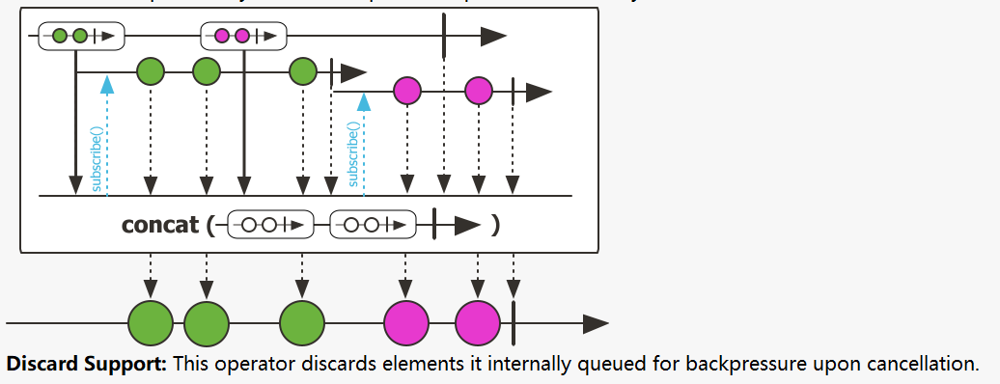
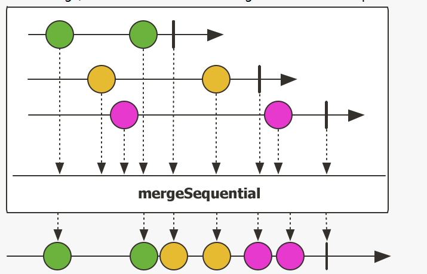

# Reactor10-数据合并

由于业务需求有的时候需要将多个数据源进行合并，Reactor提供了concat方法和merge方法。

concat方法示意图



merge方法示意图


图中可以很清楚的看出这两种合并方法的不同：

* concat是合并的flux，按照顺序分别运行，flux1运行完成以后再运行flux2
* merge是同时运行，根据时间先后运行

## concat方法使用

``` java
public class ConcatAndMerge {
    private Flux<Integer> flux1() {
        return Flux.range(1, 4);
    }

    private Flux<Integer> flux2() {
        return Flux.range(5, 8);
    }

    private Flux<String> hotFlux1() {
        return flux1().map(i -> "[1]" + i).delayElements(Duration.ofMillis(10));
    }

    private Flux<String> hotFlux2() {
        return flux2().map(i -> "[2]" + i).delayElements(Duration.ofMillis(4));
    }

    public void concatTest() throws InterruptedException {
        Flux.concat(hotFlux1(), hotFlux2())
                .subscribe(i -> System.out.print("->" + i));
        Thread.sleep(200);
    }

    public void concatWithTest() {
        flux1().concatWith(flux2())
                .log()
                .subscribe();
    }
}
```

## mergeSequential方法用法



* 跟concat有些相似，得到的结果类似。也是按顺序合并流。
* 跟concat不同在于，订阅的源是hot型，也就是没有订阅前就已经生成了数据，接收数据后根据订阅顺序重新排序。

``` java
public void mergeSequentialTest() throws InterruptedException {
    Flux.mergeSequential(hotFlux1(), hotFlux2())
            .subscribe(i -> System.out.print("->"+i));
    Thread.sleep(200);
}
```

## combineLatest用法

跟concat和merge不同该方法是将多个源的最后得到元素通过函数进行融合的到新的值

``` java
public void combineLatestTest() throws InterruptedException {
    Flux.combineLatest(hotFlux1(), hotFlux2(), (v1, v2) -> v1 + ":" + v2)
            .subscribe(i -> System.out.print("->" + i));
    Thread.sleep(200);
}
```

结果如下
```
->[1]1:[2]6->[1]1:[2]7->[1]2:[2]7->[1]2:[2]8->[1]3:[2]8->[1]3:[2]9->[1]4:[2]9->[1]4:[2]10->[1]4:[2]11->[1]4:[2]12
```

