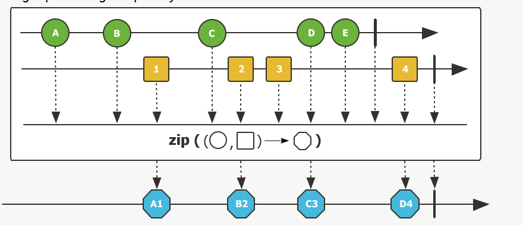
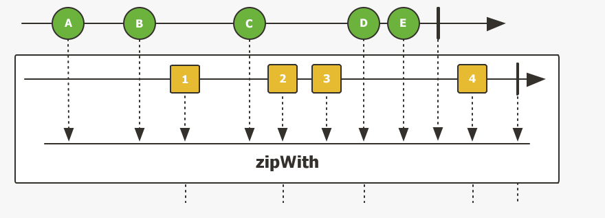

# Reactor12-数据压缩zip

处理业务的时候一定有这样的需求：将多个源数据压缩成一个，Reactor提供了zip和zipWith方法可以做到这一点。

zip和zipwith有些不同：

1. zip可以一次合并多个源
2. zipWiht一次只能合并两个

## zip方法使用

多个源压缩到一起，等待所有源发出一个元素之后，将这些元素进行组合。



``` java
public void zipTest() {
    Flux<Tuple3<String, Integer, Integer>> flux = Flux.zip(name(), age(), salary());
    Flux<Employee> employee = flux.map(tuple -> new Employee(tuple.getT1(), tuple.getT2(), tuple.getT3()));
    employee.subscribe(i -> log.info(i.toString()));
}
```

* 如果是输入publisher会将多个源自动转化为tuple类型
* 将数据转化为类
* tuple 通过getT1这类方法获取数据

zip中可以直接给出合并器

``` java
public void zipCombineTest() {
    Flux<Employee> flux = Flux.zip(objects -> {
        return new Employee((String) objects[0], (Integer) objects[1], (Integer) objects[2]);
    }, name(), age(), salary());
    flux.subscribe(i -> log.info(i.toString()));
}
```

## zipWith用法



跟with方法差不多，唯一不同的只能处理两个源：

``` java
public void zipWithTest() {
    Flux<User> flux = name().zipWith(age(), (name, age) -> new User(name, age));
    flux.subscribe(i -> log.info(i.toString()));
}
```
