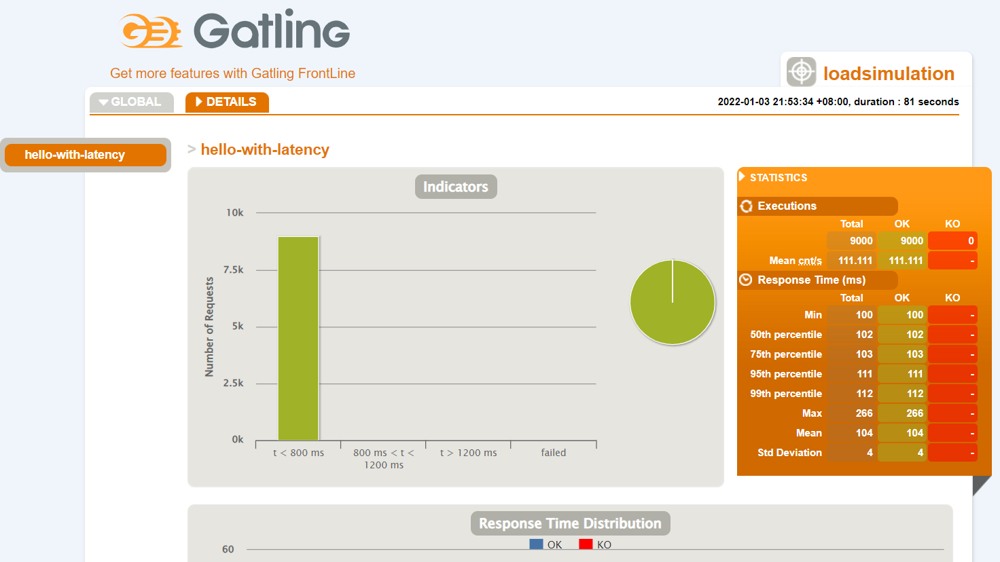

# Reactor99-性能测试工具gatling

Gateling是一个跟JMeter齐名的性能压测工具，适合通过脚本方式写测试代码。通过压测WebFlux程序直观感受一下Reactor带来的性能改进。

## 环境准备

第一步，安装Scala，Gateling基于Scala开发，压测脚本也要使用Scala来编写，因此先安装Scala。

很简单，去官网下载zip二进制压缩包，解压后。设置两个环境变量：

* SCALA_HOME：指向解压后的目录。
* PATH：在PATH中添加`%SCALA_HOME%\bin`

第二步，下载IDEA插件Scala，并配置Scala的SDK。

第三步，通过archetype来创建gateling工程。

`File -> New -> Project -> Create from archetype -> Add Archetype`

通过如下链接搜索最新的版本：

https://search.maven.org/search?q=g:io.gatling.highcharts%20AND%20a:gatling-highcharts-maven-archetype

## 准备Reactor工程

IDEA 新建一个工程，可通过Spring Initailizr来创建。增加一个简单的Controller

``` java
@RestController
public class HelloController {
    @GetMapping("/hello/{latency}")
    public Mono<String> hello(@PathVariable int latency) {
        return Mono.just("Welcome to reactive world ~")
                .delayElement(Duration.ofMillis(latency)); // 1
    }
}
```

## 编写性能压测脚本

在gateling工程中增加一个类LoadSimulation，如下

``` scala
import io.gatling.core.Predef._
import io.gatling.core.scenario.Simulation
import io.gatling.core.structure.{ChainBuilder, ScenarioBuilder}
import io.gatling.http.Predef._
import io.gatling.http.protocol.HttpProtocolBuilder

import scala.concurrent.duration._
import scala.language.postfixOps

/**
 * 1. 指定的用户量是在30秒时间内匀速增加上来的；
 * 2. 每个用户重复请求30次指定的URL，中间会随机间隔1~2秒的思考时间。
 */
class LoadSimulation extends Simulation {

  // 从系统变量读取 baseUrl、path和模拟的用户数
  //  val baseUrl: String = System.getProperty("base.url")
  //  val testPath: String = System.getProperty("test.path")
  //  val sim_users: Int = System.getProperty("sim.users").toInt
  val baseUrl: String = "http://localhost:8092/"
  val testPath: String = "hello/100"
  val sim_users: Int = 300

  val httpConf: HttpProtocolBuilder = http.baseUrl(baseUrl)

  // 定义模拟的请求，重复30次
  val helloRequest: ChainBuilder = repeat(30) {
    // 自定义测试名称
    exec(http("hello-with-latency")
      // 执行get请求
      .get(testPath))
      // 模拟用户思考时间，随机1~2秒钟
      .pause(1 seconds, 2 seconds)
  }

  // 定义模拟的场景
  val scn: ScenarioBuilder = scenario("hello")
    // 该场景执行上边定义的请求
    .exec(helloRequest)

  // 配置并发用户的数量在30秒内均匀提高至sim_users指定的数量
  setUp(scn.inject(rampUsers(sim_users).during(30 seconds)).protocols(httpConf))
}
```

修改plugin配置，指定测试脚本的类名。
```xml
<plugin>
    <groupId>io.gatling</groupId>
    <artifactId>gatling-maven-plugin</artifactId>
    <version>${gatling-maven-plugin.version}</version>
    <configuration>
        <simulationClass>com.xncoding.LoadSimulation</simulationClass>
    </configuration>
</plugin>
```

执行 `mvn clean gatling:test`

然后在target目录下会生成性能测试报告。



